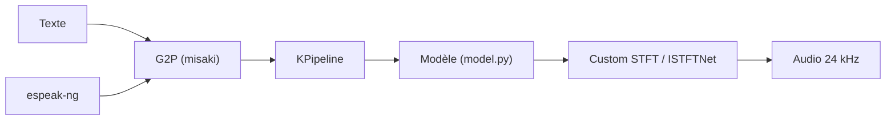

# hexgrad/kokoro

> Bibliothèque d'inférence pour Kokoro-82M, modèle de synthèse vocale léger à poids ouverts.

## Le problème
Les modèles TTS de qualité sont souvent gros, lents ou derrière une API payante.

## Ce que ça fait vraiment
Fournit `KPipeline` : le texte passe par la conversion graphèmes-phonèmes de `misaki`, puis par le modèle de 82 millions de paramètres, avec un vocodeur ISTFTNet, pour sortir de l'audio à 24 kHz. Langues : anglais américain et britannique, espagnol, français, hindi, italien, japonais, portugais brésilien, mandarin. Repli sur espeak-ng pour les mots hors dictionnaire. Une version JavaScript existe.

## Comment c'est branché


## Essayer
```py
!pip install -q kokoro>=0.9.4 soundfile
!apt-get -qq -y install espeak-ng > /dev/null 2>&1
from kokoro import KPipeline
pipeline = KPipeline(lang_code='a')
generator = pipeline(text, voice='af_heart')
```

## Coût et pièges
Gratuit. Il faut installer espeak-ng à part (installeur MSI sous Windows). Sur Mac Apple silicon, `PYTORCH_ENABLE_MPS_FALLBACK=1` active le GPU. Dernier push en août 2025, 209 issues ouvertes.

## Ce que ce n'est pas
Pas de clonage de voix documenté : on choisit parmi des voix fournies.

## Alternatives
Aucune alternative nommée dans le README.

## Pour toi
À surveiller : TTS léger et bien connu, licence Apache-2.0, mais peu actif depuis un an ; pocket-tts est plus récent si tu veux du clonage.

