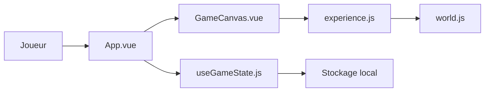

# hexianWeb/CubeCity

> Jeu web de construction de ville en 2.5D, en Three.js et Vue, au style cartoon.

## Le problème
Un petit bac à sable de gestion de ville jouable dans le navigateur, sans moteur lourd.

## Ce que ça fait vraiment
Quatre modes (sélection, construction, déplacement, démolition), équilibre résidentiel/commercial/industriel et ESG, revenus en pièces, sauvegarde locale. Les bâtiments affichent leurs états (bonus, malus) en rotation. Pile Vue 3, Three.js, Vite, Pinia, Tailwind.

## Comment c'est branché

## Essayer
Aucune commande d'installation dans le README ; il renvoie à un guide développeur séparé. Pile Vite : `npm install` puis lancement via les scripts du projet (non détaillé).

## Coût et pièges
Gratuit. Plusieurs systèmes sont listés comme futurs (échecs, événements, technologies).

## Ce que ce n'est pas
Pas un jeu terminé : la plupart des mécaniques de défi sont à venir.

## Alternatives
Aucune alternative citée dans le README.

## Pour toi
À ignorer : démo de jeu sans rapport avec data, IA ou MLOps ; seul le patron Vue + Three.js pourrait inspirer une visualisation 3D.

