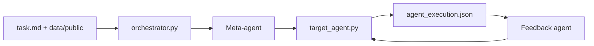

# hexo-ai/sia

> Cadre d'auto-amélioration où un agent modifie le harnais et les poids d'un agent cible, sur benchmark.

## Le problème
Améliorer un agent sur une tâche demande des cycles manuels d'essais, d'analyse des logs et de réécriture.

## Ce que ce n'est pas
Voir plus bas.

## Ce que ça fait vraiment
Trois rôles : un méta-agent crée l'agent cible à partir de la description de tâche, l'agent cible tente la tâche et journalise, un agent de retour analyse les logs et le corrige. Chaque génération est notée par `evaluate.py` sur des données privées. Quatre tâches fournies (gpqa, lawbench, longcot-chess, spaceship-titanic) ou tâche perso. Tableau de bord web local. Implémentation officielle d'un article de 2026 dont les gains sont ceux des auteurs.

## Comment c'est branché


## Essayer
```bash
pip install 'sia-agent[claude]'
export ANTHROPIC_API_KEY="..."
sia run --task gpqa --max_gen 5 --run_id 1
sia web
```

## Coût et pièges
Clés d'API à ta charge, chaque génération consomme des appels LLM. Le mode `--sandbox none` exécute du code généré avec accès à l'hôte ; utiliser `--sandbox docker` pour l'isoler.

## Ce que ce n'est pas
Pas un produit : un code de recherche. Il améliore un agent sur un benchmark, sans garantie de généralisation. La mise à jour des poids n'est pas détaillée dans le README fourni.

## Alternatives
- Aucune alternative nommée dans le README.

## Pour toi
Surveiller : intéressant pour étudier l'auto-amélioration d'agents, mais coûteux en tokens et à isoler dans Docker.
