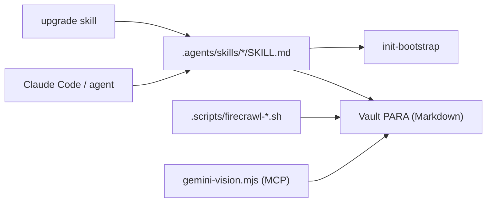

# heyitsnoah/claudesidian

> Coffre Obsidian préconfiguré avec des skills pour travailler avec Claude Code comme partenaire de réflexion.

## Le problème
Un coffre de notes Obsidian reste passif : l'agent n'a ni structure ni consignes pour y chercher, classer et relier les idées.

## Ce que ça fait vraiment
Un modèle de dépôt Git organisé en PARA (00_Inbox à 06_Metadata) et un jeu de skills dans `.agents/skills/` (thinking-partner, inbox-processor, research-assistant, daily-review, upgrade, init-bootstrap…), avec miroirs pour `.claude/skills/` et `.pi/skills/`. `/init-bootstrap` installe les dépendances, personnalise `CLAUDE.md` et initialise Git. Options : capture web via Firecrawl, analyse d'images et PDF via un serveur MCP Gemini, scripts npm.

## Comment c'est branché


## Essayer
```bash
git clone https://github.com/heyitsnoah/claudesidian.git my-vault
cd my-vault
claude
/init-bootstrap
```

## Coût et pièges
Le socle est gratuit ; Claude Code est un service à part. Firecrawl (`FIRECRAWL_API_KEY`, 300 crédits gratuits pour démarrer) et Gemini (`GEMINI_API_KEY`) sont facultatifs. Le bootstrap peut rechercher votre travail public, avec votre permission.

## Ce que ce n'est pas
Pas une application : il n'y a ni serveur ni interface web, seulement des fichiers Markdown et des instructions d'agent. Le README recommande de relire tout ce que l'IA écrit.

## Alternatives
Aucune alternative nommée dans le README.

## Pour toi
À surveiller : bon exemple d'organisation de skills et de CLAUDE.md, à picorer pour ta propre base de notes plutôt qu'à adopter tel quel.

