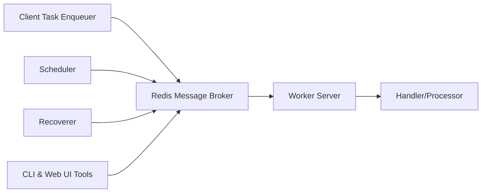

# hibiken/asynq

> File de tâches distribuée en Go, adossée à Redis, avec workers concurrents.

## Le problème
Déporter des traitements longs (mails, redimensionnement, jobs planifiés) hors du chemin de requête, avec retries fiables.

## Ce que ça fait vraiment
Le client enfile des tâches (type + payload) dans Redis ; le serveur les consomme avec un goroutine par tâche.
Exécution au moins une fois, retries, planification, tâches périodiques, déduplication, timeouts, agrégation par groupe.
Files à priorité pondérée ou stricte, middlewares, pause de file, Redis Sentinel.
Métriques Prometheus, UI web Asynqmon, CLI.

## Comment c'est branché


## Essayer
```bash
go get -u github.com/hibiken/asynq
go install github.com/hibiken/asynq/tools/asynq@latest
```

## Coût et pièges
Gratuit ; Redis ≥ 4.0 requis, certains scripts Lua incompatibles avec Redis Cluster. API en v0.x, susceptible de casser.

## Ce que ce n'est pas
Pas pour Python : bibliothèque Go uniquement. Pas un orchestrateur de workflows.

## Alternatives
Aucune alternative nommée dans le README.

## Pour toi
À ignorer côté ML en Python ; à retenir seulement si tu écris des services Go qui doivent déporter des jobs.
