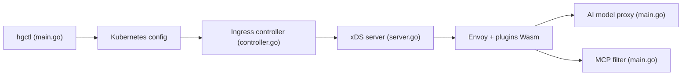

# higress-group/higress

> Passerelle API cloud-native basée sur Istio/Envoy, avec fonctions de passerelle IA et hébergement de serveurs MCP.

## Le problème
Exposer plusieurs fournisseurs de LLM, des outils MCP et des microservices demande une passerelle unique avec auth, quotas, observabilité, sans coupure lors des rechargements de configuration.

## Ce que ça fait vraiment
Contrôleur (Ingress, Gateway API, ConfigMap, plugins Wasm) qui traduit la configuration Kubernetes en config Envoy via xDS. Plugins IA : proxy de modèles, équilibrage multi-modèles, limitation de jetons, cache, recherche, agent. Hébergement MCP avec conversion OpenAPI→MCP. Plugins Wasm en Go/Rust/JS, console web, déploiement hors Kubernetes possible via Docker.

## Comment c'est branché


## Essayer
```bash
mkdir higress; cd higress
docker run -d --rm --name higress-ai -v ${PWD}:/data \
        -p 8001:8001 -p 8080:8080 -p 8443:8443  \
        higress-registry.cn-hangzhou.cr.aliyuncs.com/higress/all-in-one:latest
```

## Coût et pièges
Logiciel gratuit ; images tirées d'un registre Aliyun (miroirs US et Asie du Sud-Est indiqués). Exploitation Kubernetes/Envoy non triviale ; 1 124 issues ouvertes.

## Ce que ce n'est pas
Pas une plateforme LLM : c'est une passerelle devant des fournisseurs existants. Les clés des fournisseurs restent à ta charge. Le chiffre « plus de 90 % des besoins couverts » est une affirmation du README, non vérifiée.

## Alternatives
Aucune alternative nommée dans le README, hormis ingress-nginx dont il se dit compatible et moins gourmand.

## Pour toi
À surveiller : intéressant si tu mutualises plusieurs LLM et serveurs MCP sur Kubernetes, trop lourd pour un simple proxy local.

