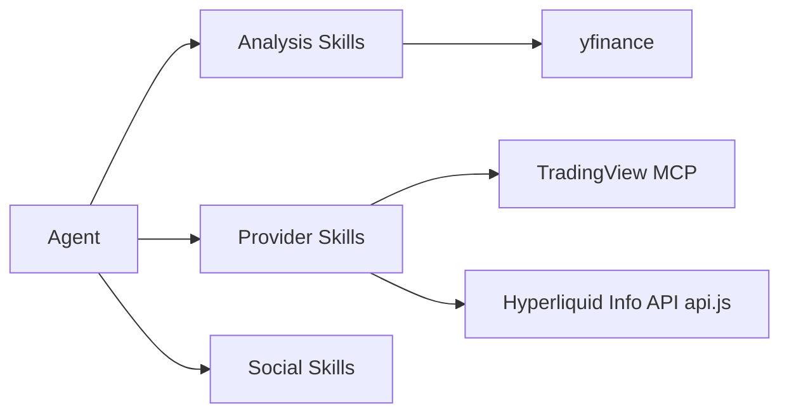

# himself65/finance-skills

> Collection de skills d'agents pour l'analyse financière : valorisation, résultats, sentiment, lecteurs de réseaux sociaux.

## Le problème
Un agent généraliste ne sait pas mener une analyse financière structurée (DCF, bilans, options) sans instructions dédiées.

## Ce que ça fait vraiment
Groupes de plugins installables : analyse de marché via yfinance (valorisation, aperçus et bilans de résultats, corrélation, liquidité, payoff d'options), lecteurs en lecture seule (Discord, LinkedIn, Telegram, Twitter/X, Y Combinator), fournisseurs de données (Adanos, Fintel, TradingView, Hyperliquid), analyse de startups, design d'UI générative et créateur de skills. Des lecteurs TradingView et Hyperliquid sont fournis en JavaScript.

## Comment c'est branché


## Essayer
```bash
npx plugins add himself65/finance-skills
npx plugins add himself65/finance-skills --yes
npx skills add himself65/finance-skills --skill yfinance-data
```

## Coût et pièges
Les skills dépendent de services tiers (Fintel, Adanos, opencli…), certains avec clé ou compte. Beaucoup passent par yfinance, dont la fiabilité des données n'est pas garantie.

## Ce que ce n'est pas
Pas un conseil financier (avertissement du README). Les instructions de chaque skill n'ont pas été relues dans ce résumé.

## Alternatives
Aucune alternative nommée dans le README.

## Pour toi
À surveiller : pratique pour doter un agent de réflexes d'analyse financière ; utile seulement si tu fais de la finance de marché.

