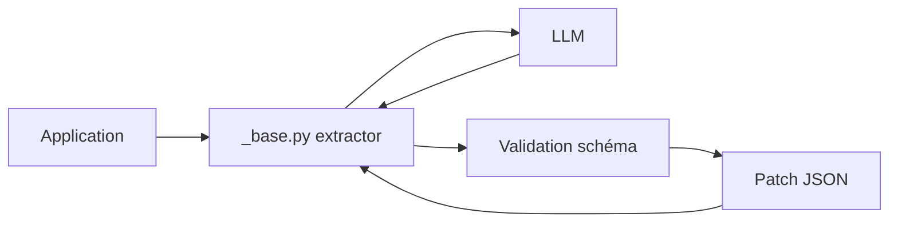

# hinthornw/trustcall

> Extraction JSON fiable par LLM : le modèle produit des patchs JSON plutôt que le document entier.

## Le problème
Un LLM échoue souvent à remplir de gros schémas imbriqués et efface des champs quand on lui demande de mettre à jour un objet.

## Ce que ça fait vraiment
`create_extractor(llm, tools=[...])` demande les arguments des outils, valide (Pydantic, dictionnaires de schéma ou fonctions Python) et, en cas d'erreur, redemande un patch JSON ciblé. Avec un dictionnaire `existing`, il ne génère que des patchs sur les objets existants ; `enable_inserts=True` gère mises à jour et créations. Marche avec les LLM à appels d'outils de LangChain.

## Comment c'est branché


## Essayer
```bash
pip install trustcall
pip install -U trustcall langchain-fireworks
make evals
```
```python
from trustcall import create_extractor
bound = create_extractor(llm, tools=[User])
```

## Coût et pièges
Chaque appel consomme le LLM ; les exemples utilisent gpt-4o (OpenAI) ou Fireworks, donc clé d'API à ta charge. Les évaluations demandent des clés et le clone d'un jeu de données LangSmith. Dernier push en juillet 2025.

## Ce que ce n'est pas
Pas une garantie contre toute erreur : c'est une boucle de retry par patch. L'auteur écrit qu'on peut recréer la logique soi-même en quelques heures.

## Alternatives
Le README compare seulement à l'appel d'outil naïf des LLM, sans dépôt concurrent nommé.

## Pour toi
Surveiller : le motif « patch, ne régénère pas » est utile pour la mémoire d'agent, mais simple à reproduire et peu actif depuis juillet 2025.

