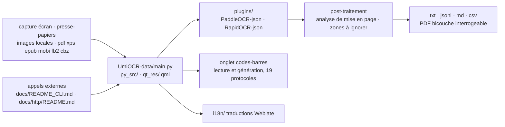

# hiroi-sora/Umi-OCR

> **Offline desktop OCR application for Windows and Linux, with command-line and HTTP interfaces.**

## The problem

Pulling text out of a screenshot, a batch of several hundred images or a scanned PDF usually
means an online service: an account, a connection, and images leaving the machine. Locally, you
end up wiring an OCR engine, a screenshot tool and a post-processing script yourself — and the
order of the recognised text blocks goes wrong as soon as the page has two columns or vertical
writing.

## What it actually does

Umi-OCR is a tabbed application: you open the tabs you need. The README describes four.
**Screenshot OCR**: a keyboard shortcut triggers a capture, recognised text appears on the right
and stays editable; images can also be pasted from the clipboard. **Batch OCR**: imports
`jpg, jpe, jpeg, jfif, png, webp, bmp, tif, tiff` with no stated count limit, exports to
`txt, jsonl, md, csv(Excel)`, and can shut down or suspend the machine when the job ends.
**Document recognition**: `pdf, xps, epub, mobi, fb2, cbz`, OCR over scans or extraction of
existing text, output as a searchable double-layer PDF. **Barcodes**: reading and generation
across 19 protocols (`QRCode`, `DataMatrix`, `PDF417`, `EAN13`, `Code128`…), several codes per
image.

Two post-processing stages do part of the work. **Layout parsing** reorders text blocks
according to a chosen scheme — `multi-column - line break per paragraph`,
`single-column - keep indentation` (meant for code screenshots), `no processing` for the
engine's raw output — and handles horizontal as well as right-to-left vertical text, provided
the engine supports it. **Ignore areas** are rectangles drawn with the mouse whose text is
dropped from the job: watermarks, logos, headers and footers. The README states the exact rule,
which is also the trap: the whole text block, not the individual character, must fall inside
the area to be ignored.

The OCR engine is offline and bundled, with several language libraries. The interface exists in
several languages (collaborative translation on Weblate), in light and dark themes, and the
renderer can be switched when hardware acceleration misbehaves. Everything is also callable from
outside: a command-line manual (`docs/README_CLI.md`) and an HTTP interface manual
(`docs/http/README.md`).

## How it is wired



No code-derived diagram exists for this repository: the graph above is reconstructed from the
README alone, which gives the tree (`UmiOCR-data/` with `main.py`, `version.py`, `qt_res`,
`py_src`, `plugins`, `i18n`) and marks `plugins` as living outside this repository. The point to
keep: the OCR engine is an external plugin, and what ships here is the application around it.

## Trying it

The README's main path is downloading a `.7z` archive or a self-extracting `.7z.exe` from the
GitHub releases, Lanzou or SourceForge: no installation, unpack and run `Umi-OCR.exe`. On
Windows, the README also documents Scoop:

```
scoop bucket add extras
```

```
scoop install extras/umi-ocr
```

```
scoop install extras/umi-ocr-paddle
```

The README warns against installing both packages at once — shortcuts may overwrite each other —
and points to the plugins repository for switching engines on the fly. No command-line
invocation or HTTP call is given in this README: they are deferred to the
`docs/README_CLI.md` and `docs/http/README.md` manuals, outside this file.

## Cost and pitfalls

- **Free, MIT, offline**: no account, no key, no quota. The README stresses that it runs without
  a network.
- **Stated platforms: Windows 7 x64 and Linux x64.** macOS and Ubuntu appear under *long-term
  plans*, not the present. A macOS machine is out of scope.
- **The repository alone is not runnable.** It holds only `UmiOCR-data` (Python sources, QML,
  translations). The runtime and plugins live in three other repositories
  (`Umi-OCR_plugins`, `Umi-OCR_runtime_windows`, `Umi-OCR_runtime_linux`), and the README sends
  developers to the two runtime repositories to set up an environment.
- **Two engines, one choice**: `PaddleOCR-json` is described as slightly faster,
  `RapidOCR-json` as better on compatibility. The two Scoop packages differ on that point alone.
- **Large images**: the README says to raise *image edge length limit* in the text-recognition
  settings, otherwise very long images are degraded.
- **Graphics rendering**: screenshot flicker or a misaligned UI are fixed by switching renderer
  or turning hardware acceleration off — a sign the display layer is machine-dependent.
- **A single maintainer**: the README states the project is developed and maintained by
  `hiroi-sora` in his spare time, with a donation link. That is the continuity risk to weigh.

## What it is not

- **It is not an OCR engine.** Recognition comes from `PaddleOCR-json` or `RapidOCR-json`, in
  separate repositories, loaded as plugins. Umi-OCR is the application around them: capture,
  batches, formats, layout, calling interfaces.
- **It is not a Python library to import**, nor a service to deploy: it is a desktop application
  shipped as an archive, whose command line and HTTP server are secondary entry points.
- **It is not a translator or a table extractor.** Image translation, offline translation, table
  recognition to Excel, history, fixed-area recognition and GPU-based OCR are all listed under
  *long-term plans*, with the caveat that these features may change or be dropped.
- **It is not broadly cross-platform**: Windows 7 x64 and Linux x64, and nothing more today.
- **Mathematical formula recognition exists** but points to an issue, with a dedicated plugin
  still to be written: do not expect the finish level of ordinary text.

## Alternatives

| | When to pick it instead |
|---|---|
| **RapidAI/RapidOCR** | The engine itself, which Umi-OCR bundles through `RapidOCR-json`. Pick it to embed OCR in your own code rather than use a desktop application. |
| **opendatalab/MinerU** | A catalogue neighbour aimed at structured document extraction. Worth a look when the goal is turning PDFs into structured content rather than getting text out of screenshots and image batches. |
| **hiroi-sora/PaddleOCR-json** | Named in the README as the second supported offline engine, described as slightly faster. Pick it directly when only raw recognition is needed. |

The other neighbours are not comparable: `Dicklesworthstone/llm_aided_ocr` is LLM-based
post-processing of OCR output, hence online and billed per use, and `sismics/docs` is a document
management system, not a recognition tool.

## For you

Useful beyond strict modelling work: it is the shortest path from screenshots, image batches or
scanned PDFs to `txt`, `jsonl`, `md` or `csv` without sending anything to a third-party service —
so it is usable on documents that may not leave the machine. The HTTP interface and command line
make it a scriptable brick in an ingestion chain, provided you are on Windows or Linux x64. Skip
it on macOS, or when you want an engine to call from Python: take RapidOCR directly.
