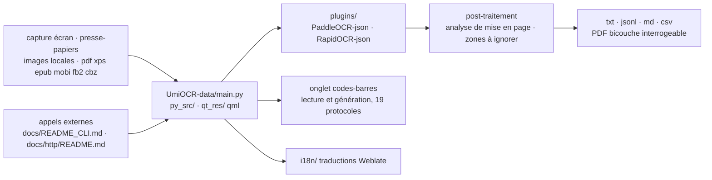

# hiroi-sora/Umi-OCR

> **Logiciel de bureau d'OCR hors ligne pour Windows et Linux, avec interfaces ligne de commande et HTTP.**

## Le problème

Extraire du texte d'une capture d'écran, d'un lot de plusieurs centaines d'images ou d'un PDF
scanné passe d'ordinaire par un service en ligne : il faut un compte, une connexion, et les
images quittent la machine. Côté local, on assemble soi-même un moteur d'OCR, un outil de
capture et un script de post-traitement, et l'ordre des blocs de texte ressort faux dès que la
page est sur deux colonnes ou en écriture verticale.

## Ce que ça fait vraiment

Umi-OCR est une application à onglets : on ouvre ceux dont on a besoin. Le README en décrit
quatre. **Capture OCR** : un raccourci clavier déclenche une capture d'écran, le texte reconnu
apparaît à droite et reste éditable ; on peut aussi coller une image depuis le presse-papiers.
**OCR par lots** : import de `jpg, jpe, jpeg, jfif, png, webp, bmp, tif, tiff`, sans limite de
nombre annoncée, export en `txt, jsonl, md, csv(Excel)`, avec extinction ou mise en veille
automatique en fin de tâche. **Reconnaissance de documents** : `pdf, xps, epub, mobi, fb2, cbz`,
OCR des scans ou extraction du texte existant, sortie en PDF bicouche interrogeable.
**Codes-barres** : lecture et génération sur 19 protocoles (`QRCode`, `DataMatrix`, `PDF417`,
`EAN13`, `Code128`…), plusieurs codes par image.

Deux traitements d'après-coup font une part du travail. L'**analyse de mise en page** réordonne
les blocs selon un schéma choisi — `multi-colonnes - saut de ligne par paragraphe`,
`mono-colonne - conserver l'indentation` (prévu pour les captures de code), `pas de traitement`
pour la sortie brute du moteur — et gère l'horizontal comme le vertical de droite à gauche, si
le moteur le sait. Les **zones à ignorer** sont des rectangles dessinés à la souris dont le
texte est écarté de la tâche : filigranes, logos, en-têtes et pieds de page. Le README précise
la règle exacte, qui est aussi le piège : c'est le bloc de texte entier, pas le caractère, qui
doit tomber dans la zone pour être ignoré.

Le moteur d'OCR est hors ligne et embarqué, avec plusieurs bibliothèques de langues. L'interface
existe en plusieurs langues (traduction collaborative sur Weblate), en thèmes clairs et sombres,
et le rendu peut être basculé si l'accélération matérielle pose problème. Le tout s'appelle
aussi depuis l'extérieur : manuel de ligne de commande (`docs/README_CLI.md`) et manuel
d'interface HTTP (`docs/http/README.md`).

## Comment c'est branché



Aucun diagramme tiré du code n'existe pour ce dépôt : ce schéma est reconstruit depuis le seul
README, qui donne l'arborescence (`UmiOCR-data/` avec `main.py`, `version.py`, `qt_res`,
`py_src`, `plugins`, `i18n`) et précise que `plugins` n'est pas dans ce dépôt. Le point à
retenir : le moteur d'OCR est un plugin externe, et le code livré ici est l'application
autour de lui.

## Essayer

La voie principale du README est le téléchargement d'une archive `.7z` ou `.7z.exe`
auto-extractible depuis les releases GitHub, Lanzou ou SourceForge : pas d'installation, on
décompresse et on lance `Umi-OCR.exe`. Sous Windows, le README documente aussi Scoop :

```
scoop bucket add extras
```

```
scoop install extras/umi-ocr
```

```
scoop install extras/umi-ocr-paddle
```

Le README avertit de ne pas installer les deux paquets en même temps — les raccourcis peuvent
s'écraser — et renvoie au dépôt de plugins pour changer de moteur à la volée. Aucune commande
d'exécution en ligne de commande ni d'appel HTTP n'est donnée dans ce README : ils sont
renvoyés aux manuels `docs/README_CLI.md` et `docs/http/README.md`, hors de ce fichier.

## Coût et pièges

- **Gratuit, MIT, hors ligne** : pas de compte, pas de clé, pas de quota. Le README insiste sur
  l'exécution sans réseau.
- **Plateformes annoncées : Windows 7 x64 et Linux x64.** macOS et Ubuntu figurent dans les
  *plans à long terme*, pas dans le présent. Un poste macOS est hors périmètre.
- **Le dépôt seul ne suffit pas à exécuter.** Il ne contient que `UmiOCR-data` (sources Python,
  QML, traductions). Le runtime et les plugins sont dans trois autres dépôts
  (`Umi-OCR_plugins`, `Umi-OCR_runtime_windows`, `Umi-OCR_runtime_linux`), et le README renvoie
  explicitement aux deux dépôts de runtime pour monter l'environnement de développement.
- **Deux moteurs, un choix à faire** : `PaddleOCR-json` est annoncé un peu plus rapide,
  `RapidOCR-json` d'une meilleure compatibilité. Les deux paquets Scoop diffèrent sur ce seul
  point.
- **Grandes images** : le README indique de relever *limite de longueur d'arête d'image* dans
  les réglages de reconnaissance, sans quoi les images très longues sont dégradées.
- **Rendu graphique** : scintillement de capture ou interface décalée se corrigent en changeant
  de moteur de rendu ou en coupant l'accélération matérielle — signe que la couche d'affichage
  n'est pas neutre selon la machine.
- **Un seul mainteneur** : le README dit que le projet est développé et maintenu par
  `hiroi-sora` sur son temps libre, avec un lien de don. C'est le risque de continuité à peser.

## Ce que ce n'est pas

- **Ce n'est pas un moteur d'OCR.** La reconnaissance vient de `PaddleOCR-json` ou
  `RapidOCR-json`, dans des dépôts séparés, chargés en plugin. Umi-OCR est l'application
  autour : capture, lots, formats, mise en page, interfaces d'appel.
- **Ce n'est pas une bibliothèque Python à importer**, ni un service à déployer : c'est une
  application de bureau, distribuée en archive, dont la ligne de commande et le serveur HTTP
  sont des portes d'entrée annexes.
- **Ce n'est pas un traducteur ni un extracteur de tableaux.** Traduction d'images, traduction
  hors ligne, reconnaissance de tableaux vers Excel, historique, reconnaissance de zone fixe et
  OCR sur GPU sont listés dans les *plans à long terme*, avec la mention que ces fonctions
  peuvent être modifiées ou abandonnées.
- **Ce n'est pas un outil multiplateforme au sens large** : Windows 7 x64 et Linux x64, rien de
  plus à ce jour.
- **La reconnaissance de formules mathématiques existe** mais renvoie à une issue, et un plugin
  dédié reste à faire : ne pas s'attendre au même niveau de finition que le texte courant.

## Alternatives

| | Quand le préférer |
|---|---|
| **RapidAI/RapidOCR** | C'est le moteur lui-même, qu'Umi-OCR embarque via `RapidOCR-json`. À préférer si l'on veut intégrer l'OCR dans son propre code plutôt qu'utiliser une application de bureau. |
| **opendatalab/MinerU** | Voisin du catalogue, orienté extraction structurée de documents. À regarder si l'objectif est de convertir des PDF en contenu structuré plutôt que de récupérer du texte depuis des captures et des lots d'images. |
| **hiroi-sora/PaddleOCR-json** | Nommé dans le README comme second moteur hors ligne pris en charge, annoncé un peu plus rapide. À préférer en appel direct si seule la reconnaissance brute est nécessaire. |

Les autres voisins ne sont pas comparables : `Dicklesworthstone/llm_aided_ocr` est un
post-traitement d'OCR par LLM, donc en ligne et payant à l'usage, et `sismics/docs` est une
gestion électronique de documents, pas un outil de reconnaissance.

## Pour toi

Intéressant hors du strict périmètre modélisation : c'est le chemin le plus court pour
transformer des captures, des lots d'images ou des PDF scannés en `txt`, `jsonl`, `md` ou `csv`
sans envoyer quoi que ce soit à un service tiers — donc utilisable sur des documents qu'on n'a
pas le droit de sortir de la machine. L'interface HTTP et la ligne de commande en font une
brique scriptable dans une chaîne d'ingestion, à condition d'être sous Windows ou Linux x64. À
laisser de côté si l'on travaille sur macOS, ou si l'on veut un moteur à appeler depuis du
Python : prendre RapidOCR directement.
