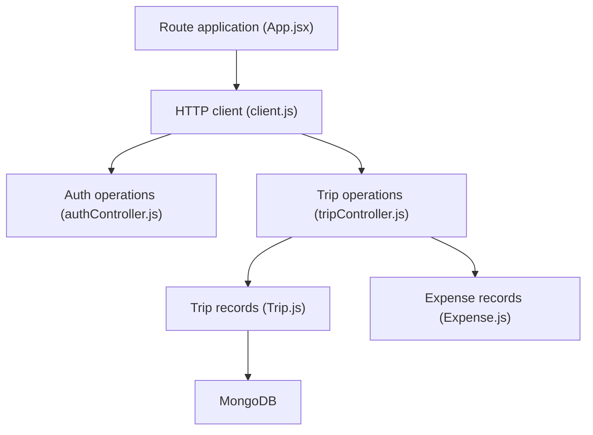

# hitesh-kumar123/Travel-Plans-

> Application MERN de planification de voyages : trajets, dépenses, météo, traduction, pour développeurs web.

## Le problème
Itinéraires, budgets et outils de voyage sont dispersés entre plusieurs applications.

## Ce que ça fait vraiment
Gestion de voyages, suivi des dépenses avec graphiques Recharts et export CSV, météo OpenWeatherMap (5 jours), traduction via `google-translate-api-x` sans clé, authentification JWT. La recherche et la réservation de vols/hôtels utilisent des **données fictives**. Le README se dit « production-ready » ; ce n'est pas démontré.

## Comment c'est branché


## Essayer
```bash
git clone https://github.com/hitesh-kumar123/Travel-Plans-.git
cd Travel-Plans-
cp .env.example server/.env
cd server && npm install && npm run dev
# autre terminal :
cd client && npm install && npm start
```

## Coût et pièges
MongoDB (local ou Atlas) et clé OpenWeatherMap gratuite requis ; `JWT_SECRET` à définir. Lancer depuis la racine échoue. 509 issues ouvertes.

## Ce que ce n'est pas
Pas un outil de réservation réel. README désordonné (blocs de code cassés).

## Alternatives
Aucune alternative nommée dans le README.

## Pour toi
Ignorer : application web généraliste sans composant data/IA (l'itinéraire IA n'est qu'une idée de roadmap).

