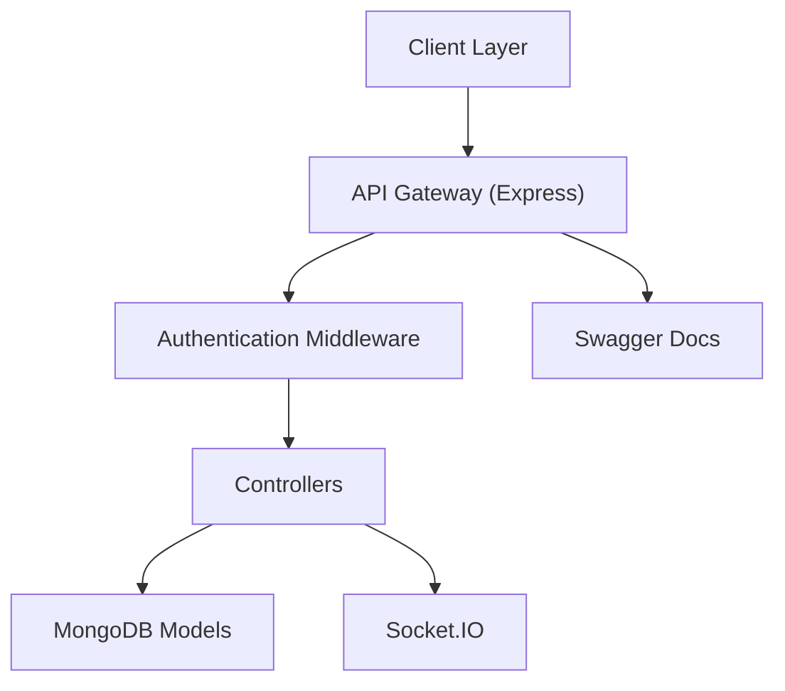

# hiteshchoudhary/apihub

> Hub d'API gratuites (FreeAPI.app) pour apprendre à consommer des API et remplir un portfolio front.

## Le problème
Les débutants manquent d'API réalistes et gratuites pour s'entraîner à l'intégration front, sans en construire une eux-mêmes.

## Ce que ça fait vraiment
Serveur Express sur MongoDB exposant des API d'apprentissage : authentification JWT, chat (Socket.IO), e-commerce, todo, réseau social, plus des API publiques. Documentation Swagger générée depuis `swagger.yaml`. Des tests Playwright couvrent les endpoints. Le serveur public est réinitialisé (fichiers et base) toutes les deux heures pour limiter les coûts.

## Comment c'est branché


## Essayer
```bash
docker-compose up --build --attach backend
yarn install
yarn start
yarn start:test-server
yarn test:playwright
```

## Coût et pièges
Gratuit, mais il faut créer un `.env` depuis `.env.sample` avec des identifiants. Sur l'instance publique, toutes les données disparaissent toutes les deux heures : à héberger soi-même pour tout usage durable.

## Ce que ce n'est pas
Pas une API de production ni un catalogue de données : c'est un terrain d'entraînement avec données réinitialisées.

## Alternatives
Aucune alternative nommée dans le README.

## Pour toi
À ignorer pour du travail data/IA : c'est un outil pédagogique web, sans lien avec les modèles ni les données ; la licence est aussi à vérifier.

