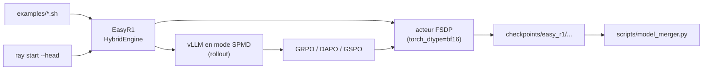

# hiyouga/EasyR1

> Fork de veRL pour entraîner par renforcement des modèles de langage et vision-langage.

## Le problème
veRL ne couvrait pas les modèles vision-langage ; ajouter le multimodal à un pipeline GRPO existant
demande de toucher au moteur d'entraînement et au moteur de rollout en même temps.

## Ce que ça fait vraiment
Reprend veRL et y ajoute Qwen2-VL / Qwen2.5-VL / Qwen3-VL, en plus des modèles texte Llama3, Qwen2/3
et des distillations DeepSeek-R1. Implémente GRPO, DAPO, Reinforce++, ReMax, RLOO, GSPO, CISPO.
Accepte tout dataset texte ou vision-texte au format attendu, avec entraînement sans padding, LoRA,
reprise sur le dernier ou le meilleur checkpoint, et suivi Wandb / SwanLab / MLflow / TensorBoard.
Le README chiffre la VRAM requise de 1,5B à 72B, en AMP et BF16, plein paramètres et LoRA.

## Comment c'est branché


## Essayer
```bash
docker pull hiyouga/verl:ngc-th2.8.0-cu12.9-vllm0.11.0
docker run -it --ipc=host --gpus=all hiyouga/verl:ngc-th2.8.0-cu12.9-vllm0.11.0
git clone https://github.com/hiyouga/EasyR1.git && cd EasyR1 && pip install -e .
bash examples/qwen2_5_vl_7b_geo3k_grpo.sh
bash examples/qwen3_vl_4b_geo3k_grpo_lora.sh
python3 scripts/model_merger.py --local_dir checkpoints/easy_r1/exp_name/global_step_1/actor
ray start --head --port=6379 --dashboard-host=0.0.0.0
```

## Coût et pièges
Gratuit, mais le ticket d'entrée est matériel : 2×24 Go pour un 1,5B en AMP, 32×80 Go pour un 72B.
Dépendances tendues (`vllm>=0.8.3`, `flash-attn`, `transformers>=4.54.0`), d'où le Docker fourni.
`deepspeed` installé dans le même environnement casse l'exécution et doit être désinstallé.

## Ce que ce n'est pas
Pas un outil de SFT ni d'inférence : le README l'exclut explicitement et renvoie à LlamaFactory. Les
VLM ne sont pas encore compatibles avec le parallélisme Ulysses — bug connu et assumé. Le README
héberge aussi de la promotion pour un autre projet du même auteur.

## Alternatives
- veRL : le projet d'origine, sans le support vision-langage.
- LlamaFactory : pour le SFT et l'inférence, que ce dépôt refuse de couvrir.

## Pour toi
Le chemin le plus court vers un GRPO multimodal reproductible, si tu as les GPU en face.
