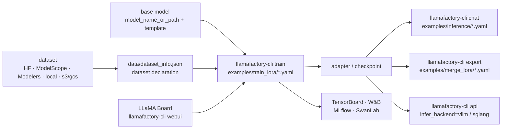

# hiyouga/LLaMA-Factory

> **A command-line and YAML workshop for fine-tuning roughly a hundred families of open models.**

## The problem

Fine-tuning an open model without tooling means rewiring the same plumbing every time: the model's
own chat template, the dataset format, LoRA adapters, quantisation, DeepSpeed, then a separate
inference script and an adapter merge to check the result. The code is rebuilt per model and per
method, and nothing is comparable across experiments.

## What it actually does

LlamaFactory puts a uniform layer on top of the Hugging Face ecosystem — the README credits PEFT,
TRL, QLoRA and FastChat as its foundations. One `llamafactory-cli` command plus a YAML file
describes training, inference and export, whatever the model.

The supported-models table lists, for each family, the available sizes and the chat `template` to
use: BLOOM, DeepSeek, Gemma 3, GLM-4.5, GPT-OSS, Qwen3-VL, Llama 4 and more, with "Day 0" support
claimed for several of them.

The method matrix crosses training regimes (pre-training, multimodal supervised fine-tuning, reward
modeling, PPO, DPO, KTO, ORPO, SimPO) with parameter regimes (full-tuning, freeze-tuning, LoRA,
QLoRA, OFT, QOFT) — every cell is ticked. On top sit optimisers and tricks switched on by a YAML
key: GaLore, BAdam, APOLLO, Adam-mini, Muon, DoRA, LongLoRA, LoRA+, PiSSA, FlashAttention-2,
Unsloth, Liger Kernel, NEFTune.

Around training: LLaMA Board, a no-code Gradio UI (`llamafactory-cli webui`); experiment tracking to
TensorBoard, W&B, MLflow or SwanLab in two lines of YAML; an OpenAI-style API server backed by vLLM
or SGLang; checkpoint export, including an Ollama Modelfile. Models and datasets can come from
Hugging Face, ModelScope, Modelers, local disk or an s3/gcs path.

## How it is wired

No code-derived diagram exists for this repository: the graph below is rebuilt from the README alone.



## Trying it

Install from source, exactly as the README gives it:

```bash
git clone --depth 1 https://github.com/hiyouga/LlamaFactory.git
cd LlamaFactory
pip install -e .
pip install -r requirements/metrics.txt
```

Or from the published Docker image:

```bash
docker run -it --rm --gpus=all --ipc=host hiyouga/llamafactory:latest
```

The three quickstart commands (LoRA on Qwen3-4B-Instruct: train, chat, merge):

```bash
llamafactory-cli train examples/train_lora/qwen3_lora_sft.yaml
llamafactory-cli chat examples/inference/qwen3_lora_sft.yaml
llamafactory-cli export examples/merge_lora/qwen3_lora_sft.yaml
```

The GUI and the API service:

```bash
llamafactory-cli webui
API_PORT=8000 llamafactory-cli api examples/inference/qwen3.yaml infer_backend=vllm vllm_enforce_eager=true
```

## Cost and gotchas

- **A GPU is required, and the VRAM budget is in the README's table** (figures marked *estimated*):
  for a 7B model, 120GB for full-tuning in `bf16/fp16`, 60GB in `pure_bf16`, 16GB for
  LoRA/Freeze/GaLore/OFT, 10/6/4GB for QLoRA at 8/4/2 bits. For a 70B model: 1200GB full-tuning,
  160GB LoRA, 48GB QLoRA 4-bit. The scaling rules `18x` / `2x` / `x/2` GB are given as such.
- **A tight version window**: Python 3.11 minimum, torch >= 2.0.0 (2.6.0 recommended),
  transformers >= 4.49.0, plus datasets, accelerate, peft, trl. Optional: CUDA >= 11.6 (12.2
  recommended), deepspeed, bitsandbytes, vllm, flash-attn. The Docker image pins Ubuntu 22.04
  x86_64, CUDA 12.4, Python 3.11, PyTorch 2.6.0, Flash-attn 2.7.4.
- **The README states "Installation is mandatory"**, and extras (`metrics`, `deepspeed`, plus
  `examples/requirements/`) are installed separately.
- **Weight licences, not code licence.** The repository is Apache-2.0, but the README requires you
  to follow each model's own licence and lists about twenty of them (Llama, Llama 2/3/4, Qwen,
  Gemma, GLM-4, Phi, StarCoder 2…). Several carry commercial-use clauses — the point to clear
  before any deployment, and the reason for the alert.
- **Third-party accounts for tracking**: W&B needs `WANDB_API_KEY`, SwanLab an API key
  (`swanlab_api_key`, the `SWANLAB_API_KEY` variable, or `swanlab login`). Both optional —
  TensorBoard and LLaMA Board stay local.
- **Documentation is flagged "WIP"** in the README, which also warns that any site other than the
  ones it lists is an unauthorised third party.
- Mirror switches by environment variable when Hugging Face is unreachable: `USE_MODELSCOPE_HUB=1`
  or `USE_OPENMIND_HUB=1`.

## What it is not

- **It is not a model** and ships no weights: nothing to train on comes with it. The base model and
  the dataset come from elsewhere, and their quality decides the outcome.
- **It is not an inference engine.** The API service delegates to vLLM or SGLang; speed and memory
  gains come from Unsloth, Liger Kernel, FlashAttention-2, bitsandbytes, KTransformers. LlamaFactory
  unifies their configuration, it does not replace them.
- **"Zero-code" does not mean no work**: you still have to shape the data into the expected format
  and declare it in `data/dataset_info.json`, pick the right `template`, and stay within the VRAM
  budget. The README points to Easy Dataset, DataFlow and GraphGen for building data — that is not
  its job.

## Alternatives

| | When to prefer it |
|---|---|
| **huggingface/peft** + **huggingface/trl** | Named in the README as the foundations LlamaFactory benefits from. Prefer them when you write your own training loop and want it under your control, without the YAML layer. |
| **unslothai/unsloth** | Listed among the "practical tricks" and usable *inside* LlamaFactory. Prefer it alone when the goal is purely speed and memory footprint on a single GPU, not breadth of methods. |
| **hiyouga/EasyR1** | Announced in the changelog by the same team: a multimodal RL training framework aimed at GRPO. Prefer it when the need is large-scale reinforcement learning rather than tooled SFT/DPO. |

The neighbour `PacktPublishing/LLM-Engineers-Handbook` is not comparable: it is a book with
companion code, not a fine-tuning tool.

## For you

Adopt it as the default tool whenever an open model has to be fine-tuned: the models-by-methods
matrix covers most of what you actually try, and moving from LoRA to QLoRA, from SFT to DPO, or from
one model to another is a YAML change — so experiments stay comparable. That YAML is also what you
version and replay in CI, which makes it a clean MLOps entry point. The real trade-off is hardware:
without a GPU matching the VRAM table, the tool changes nothing about the equation.
