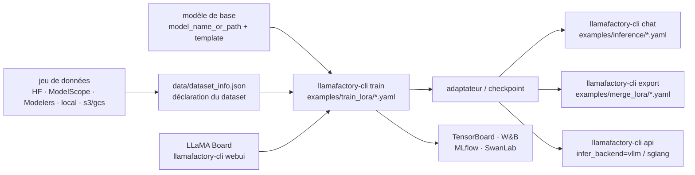

# hiyouga/LLaMA-Factory

> **Un atelier de fine-tuning en ligne de commande et en YAML, pour une centaine de familles de modèles ouverts.**

## Le problème

Fine-tuner un modèle ouvert sans outillage, c'est recâbler à chaque fois la même plomberie :
gabarit de conversation propre au modèle, format de jeu de données, adaptateurs LoRA, quantification,
DeepSeed, puis un script d'inférence et une fusion d'adaptateurs pour vérifier le résultat. Le code
est refait par modèle et par méthode, et rien ne se compare d'une expérience à l'autre.

## Ce que ça fait vraiment

LlamaFactory pose une couche uniforme au-dessus de l'écosystème Hugging Face (le README cite PEFT,
TRL, QLoRA et FastChat comme socles) : une commande `llamafactory-cli` et un fichier YAML décrivent
l'entraînement, l'inférence et l'export, quel que soit le modèle.

Le catalogue des modèles pris en charge est tabulé dans le README avec, pour chacun, les tailles et
le nom du *template* de conversation à employer — de BLOOM à Qwen3-VL, DeepSeek, Gemma 3, GLM-4.5,
GPT-OSS, Llama 4. Le README revendique une prise en charge « Day 0 » pour plusieurs familles.

La matrice des méthodes croise les régimes d'entraînement (pré-entraînement, SFT supervisé
multimodal, reward modeling, PPO, DPO, KTO, ORPO, SimPO) et les régimes de paramètres (full-tuning,
freeze-tuning, LoRA, QLoRA, OFT, QOFT) : toutes les cases sont cochées. S'y ajoutent des optimiseurs
et astuces branchables par une clé YAML — GaLore, BAdam, APOLLO, Adam-mini, Muon, DoRA, LongLoRA,
LoRA+, PiSSA, FlashAttention-2, Unsloth, Liger Kernel, NEFTune.

Autour de l'entraînement : LLaMA Board, une interface Gradio sans code (`llamafactory-cli webui`) ;
le suivi d'expériences vers TensorBoard, W&B, MLflow ou SwanLab par deux lignes de YAML ; un serveur
d'API compatible OpenAI adossé à vLLM ou SGLang ; l'export de checkpoints, y compris en Modelfile
Ollama. Les modèles et jeux de données peuvent venir de Hugging Face, ModelScope, Modelers, du disque
local ou d'un chemin s3/gcs.

## Comment c'est branché

Aucun diagramme tiré du code n'existe pour ce dépôt : ce schéma est reconstruit depuis le seul README.



## Essayer

Installation depuis les sources, telle que le README la donne :

```bash
git clone --depth 1 https://github.com/hiyouga/LlamaFactory.git
cd LlamaFactory
pip install -e .
pip install -r requirements/metrics.txt
```

Ou par l'image Docker publiée :

```bash
docker run -it --rm --gpus=all --ipc=host hiyouga/llamafactory:latest
```

Les trois commandes du démarrage rapide (LoRA sur Qwen3-4B-Instruct : entraînement, inférence,
fusion) :

```bash
llamafactory-cli train examples/train_lora/qwen3_lora_sft.yaml
llamafactory-cli chat examples/inference/qwen3_lora_sft.yaml
llamafactory-cli export examples/merge_lora/qwen3_lora_sft.yaml
```

L'interface graphique et le service d'API :

```bash
llamafactory-cli webui
API_PORT=8000 llamafactory-cli api examples/inference/qwen3.yaml infer_backend=vllm vllm_enforce_eager=true
```

## Coût et pièges

- **GPU obligatoire, et la VRAM se lit dans le tableau du README** (chiffres annoncés comme
  *estimés*) : pour un 7B, 120 Go en full-tuning `bf16/fp16`, 60 Go en `pure_bf16`, 16 Go en
  LoRA/Freeze/GaLore/OFT, 10/6/4 Go en QLoRA 8/4/2 bits. Pour un 70B, 1200 Go en full-tuning,
  160 Go en LoRA, 48 Go en QLoRA 4 bits. La règle d'échelle `18x` / `2x` / `x/2` Go est donnée
  telle quelle.
- **Fenêtre de versions serrée** : Python 3.11 minimum, torch ≥ 2.0.0 (2.6.0 recommandé),
  transformers ≥ 4.49.0, datasets, accelerate, peft, trl. En optionnel, CUDA ≥ 11.6 (12.2
  recommandé), deepspeed, bitsandbytes, vllm, flash-attn. L'image Docker fige Ubuntu 22.04 x86_64,
  CUDA 12.4, Python 3.11, PyTorch 2.6.0, Flash-attn 2.7.4.
- **Le README écrit « Installation is mandatory »** : pas d'usage sans installation préalable, et
  les extras (`metrics`, `deepspeed`, plus `examples/requirements/`) s'installent séparément.
- **Licences des poids, pas du code.** Le dépôt est Apache-2.0, mais le README impose de respecter
  la licence propre à chaque modèle et en liste une vingtaine (Llama, Llama 2/3/4, Qwen, Gemma,
  GLM-4, Phi, StarCoder 2…). Plusieurs portent des clauses d'usage commercial : c'est le point à
  lever avant tout déploiement, et la raison de l'alerte.
- **Comptes tiers pour le suivi d'expériences** : W&B demande `WANDB_API_KEY`, SwanLab une clé
  d'API (`swanlab_api_key`, variable `SWANLAB_API_KEY` ou `swanlab login`). Tous deux facultatifs —
  TensorBoard et LLaMA Board restent locaux.
- **Documentation annoncée « WIP »** dans le README, et une note avertit que tous les sites autres
  que ceux listés sont des tiers non autorisés.
- Bascule de miroir par variable d'environnement si Hugging Face est inaccessible :
  `USE_MODELSCOPE_HUB=1` ou `USE_OPENMIND_HUB=1`.

## Ce que ce n'est pas

- **Ce n'est pas un modèle**, ni des poids : rien n'est livré à entraîner dessus. Modèle de base et
  jeu de données viennent d'ailleurs, et c'est leur qualité qui décide du résultat.
- **Ce n'est pas un moteur d'inférence.** Le service d'API délègue à vLLM ou SGLang ; les gains de
  vitesse et de mémoire viennent d'Unsloth, Liger Kernel, FlashAttention-2, bitsandbytes,
  KTransformers. LlamaFactory unifie leur configuration, il ne les remplace pas.
- **« Zero-code » ne veut pas dire sans travail** : il reste à préparer les données au format attendu
  et à déclarer le dataset dans `data/dataset_info.json`, à choisir le bon `template` et à tenir le
  budget VRAM. Le README renvoie à Easy Dataset, DataFlow et GraphGen pour fabriquer les données —
  ce n'est pas son métier.

## Alternatives

| | Quand le préférer |
|---|---|
| **huggingface/peft** + **huggingface/trl** | Cités par le README comme socles dont LlamaFactory bénéficie. À préférer quand on écrit sa propre boucle d'entraînement et qu'on veut la maîtriser ligne à ligne, sans la couche YAML. |
| **unslothai/unsloth** | Cité dans les « practical tricks », intégrable *dans* LlamaFactory. À préférer seul quand l'objectif est uniquement la vitesse et l'empreinte mémoire sur un GPU unique, pas la couverture de méthodes. |
| **hiyouga/EasyR1** | Annoncé dans le changelog par la même équipe : cadre d'apprentissage par renforcement multimodal orienté GRPO. À préférer quand le besoin est du RL à grande échelle plutôt que du SFT/DPO outillé. |

Le voisin `PacktPublishing/LLM-Engineers-Handbook` n'est pas comparable : c'est un livre accompagné
de code, pas un outil de fine-tuning.

## Pour toi

À adopter comme outil par défaut dès qu'il faut fine-tuner un modèle ouvert : la matrice
modèles × méthodes couvre à peu près tout ce qu'on essaie en pratique, et le passage de LoRA à QLoRA,
de SFT à DPO ou d'un modèle à l'autre se fait en changeant un YAML — donc les expériences se
comparent. Le YAML est aussi ce qui se versionne et se rejoue en CI, ce qui en fait un point d'entrée
MLOps propre. Le vrai arbitrage reste matériel : sans GPU à la hauteur du tableau de VRAM, l'outil ne
change rien à l'équation.
