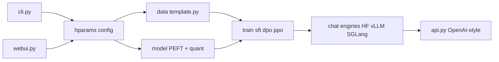

# hiyouga/LlamaFactory

> Boîte à outils de fine-tuning de LLM et VLM par CLI, Web UI ou API, sans code.

## Le problème
Fine-tuner un modèle ouvert demande d'assembler Transformers, PEFT, TRL, quantification et gabarits de chat, avec des réglages différents pour chaque famille de modèles.

## Ce que ça fait vraiment
`llamafactory-cli` (`cli.py`), la Web UI Gradio (`webui.py`) et l'API (`api.py`) passent par une même configuration (`hparams/`), qui pilote données, modèle, entraînement et service.
Méthodes : pré-entraînement, SFT, reward model, PPO, DPO, KTO, ORPO ; full, freeze, LoRA, QLoRA 2 à 8 bits ; GaLore, DoRA, LongLoRA, etc. Gabarits de chat et appels d'outils dans `template.py`.
Inférence via Hugging Face, vLLM ou SGLang derrière une API au format OpenAI. Suivi : LlamaBoard, TensorBoard, Wandb, MLflow. Une pile « v1 » plus modulaire vit à côté de la pile classique.

## Comment c'est branché


## Essayer
```bash
pip install "huggingface_hub<1.0.0"
huggingface-cli login
```
La section « usage » est tronquée dans la partie lue du README : pas d'autre commande disponible.

## Coût et pièges
Gratuit, Apache-2.0 ; GPU nécessaire (CUDA, ROCm ou Ascend NPU) ; Python 3.11 minimum. Certains jeux de données exigent un compte Hugging Face.

## Ce que ce n'est pas
Pas un service géré : tu fournis le matériel. Deux piles (classique et v1) coexistent, ce qui brouille la lecture du code. Le README met en avant le projet PenguinHarness de la même équipe.

## Alternatives
Aucune alternative nommée dans le README (Unsloth y figure comme accélération intégrée).

## Pour toi
À adopter pour tes fine-tunings LoRA/DPO sur modèles ouverts.
