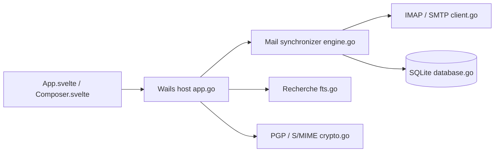

# hkdb/aerion

> Client mail de bureau léger (Wails + Svelte) pour Linux, inspiré de Geary, sans dépendance aux comptes GNOME.

## Le problème
Sous Linux, les clients mail sont jugés lourds ou dépendants de services système (Thunderbird, Geary, Evolution, Mailspring en Electron).

## Ce que ça fait vraiment
Gère plusieurs comptes (IMAP/SMTP, Gmail, Microsoft 365, Yahoo, Proton via Bridge, etc.), boîte unifiée, fils de conversation, composeur WYSIWYG, recherche locale et IMAP, PGP et S/MIME, notifications. Une extension calendrier et contacts (alpha) est désactivée par défaut. L'hôte Go/Wails synchronise et stocke dans SQLite.

## Comment c'est branché

## Essayer
Le README ne donne pas de commande : il renvoie au guide d'installation officiel et à la documentation.

## Coût et pièges
Gratuit ; certains fournisseurs sont marqués « pas encore testés ». Le README avoue que le projet s'appuie beaucoup sur des modèles Claude pour l'implémentation. 118 issues ouvertes.

## Ce que ce n'est pas
Ce n'est pas un client mature : dépôt créé en janvier 2026, calendrier et contacts en alpha. Il n'y a pas de webmail ni de serveur.

## Alternatives
- Thunderbird, Geary, Mailspring, Evolution : cités comme les clients qu'il veut remplacer.

## Pour toi
À surveiller : un client mail léger à suivre si tu es sous Linux, mais sans lien avec la data ou le MLOps, et très jeune.

