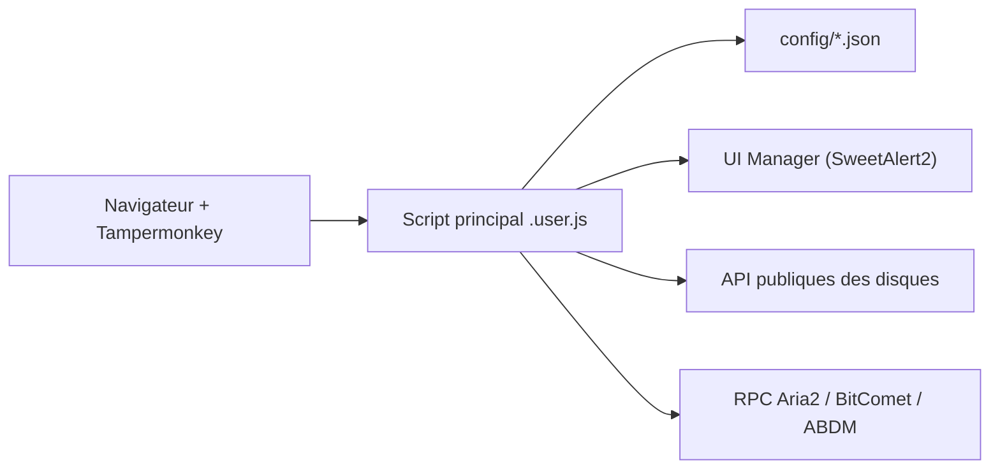

# hmjz100/LinkSwift

> Script utilisateur qui récupère les liens de téléchargement directs de neuf services de stockage chinois.

## Le problème
Les clients officiels de certains disques en ligne sont contraignants ; on veut obtenir un lien direct pour un autre gestionnaire de téléchargement.

## Ce que ça fait vraiment
Un userscript (Tampermonkey ou équivalent) qui injecte des boutons dans les pages de Baidu, Alibaba, China Mobile, Tianyi, Xunlei, Guangya, Quark, UC et 123 Pan. Il appelle leurs API publiques pour obtenir les liens, restyle les pages et pousse les liens vers Aria2, BitComet, IDM ou AB Download Manager. Chaque service a un fichier de config JSON. Le README, en chinois, précise que le projet ne contourne aucune limite de vitesse.

## Comment c'est branché

## Essayer
Aucune commande : on installe le script depuis un lien (GitHub, OpenUserJS ou ScriptCat), la version canari étant la version instable.

## Coût et pièges
Gratuit, mais il faut un compte sur chaque disque visé et un gestionnaire de scripts. Une seule personne maintient le script ; les rapports de bugs ne sont acceptés que sur GitHub. Licence AGPL-3.0.

## Ce que ce n'est pas
Ce n'est pas un accélérateur de téléchargement, l'auteur le dit explicitement. Les versions obtenues hors des canaux officiels sont sans garantie.

## Alternatives
Le README cite le script d'origine, `syhyz1990/baiduyun` (« Direct Link Download Assistant »), dont LinkSwift est dérivé.

## Pour toi
Ignorer : outil de confort sur des services chinois, maintenu par une seule personne et hors du champ data / IA.

