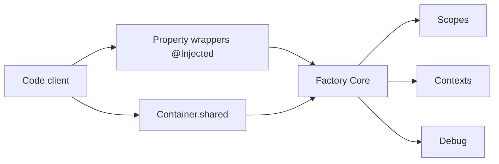

# hmlongco/Factory

> Bibliothèque d'injection de dépendances par conteneur pour Swift et SwiftUI, pour développeurs iOS et macOS.

## Le problème
Sans injection de dépendances, les vues et modèles créent leurs services en dur, ce qui rend les aperçus et les tests difficiles à isoler.

## Ce que ça fait vraiment
On déclare un service comme propriété calculée d'un `Container` (`self { MyService() }`), puis on l'injecte avec `@Injected` ou en appelant le conteneur. Des scopes (singleton, cached, shared, session) règlent la durée de vie. Les contextes (debug, aperçu, tests, UITests) permettent de substituer des doublures ; un trait `.container` isole les tests Swift Testing. Un traçage de résolution existe en mode debug.

## Comment c'est branché


## Essayer
```swift
extension Container {
    var myService: Factory<MyServiceType> {
        self { MyService() }
    }
}
```
Installation via Swift Package Manager, puis `import FactoryKit`.

## Coût et pièges
Gratuit. Ne pas copier `FactoryKit` dans la cible de tests (doublons de factories). Depuis la 3.x, CocoaPods n'est plus géré. Les macros sont non publiées.

## Ce que ce n'est pas
Ce n'est pas un framework d'architecture, seulement un conteneur d'injection. Il est maintenu par une seule personne.

## Alternatives
Resolver (du même auteur, cité dans le README) si tu utilises encore une version antérieure.

## Pour toi
À ignorer : purement iOS/Swift, sans lien avec la data ou le MLOps.

