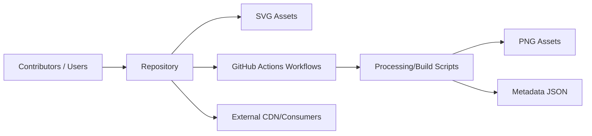

# homarr-labs/dashboard-icons

> Collection de plus de 1800 icônes de services pour tableaux de bord auto-hébergés, servie par CDN.

## Le problème
Trouver des icônes cohérentes et en bon format pour chaque service d'un tableau de bord (Plex, Nextcloud…) prend du temps.

## Ce que ça fait vraiment
Dépôt d'icônes en SVG (source), PNG et WEBP générés en 512 px, variantes `-light` et `-dark`, nommage en kebab-case, métadonnées JSON. Scripts Python et GitHub Actions convertissent, compressent et valident les contributions. Accès via le site dashboardicons.com, un serveur MCP, ou jsDelivr et raw GitHub. Les soumissions passent désormais par un formulaire du site.

## Comment c'est branché


## Essayer
```bash
curl -O https://cdn.jsdelivr.net/gh/homarr-labs/dashboard-icons/svg/nextcloud.svg
wget https://cdn.jsdelivr.net/gh/homarr-labs/dashboard-icons/svg/nextcloud.svg
```

## Coût et pièges
Gratuit. Les marques représentées restent soumises au droit des marques de leurs propriétaires, quelle que soit la licence du dépôt.

## Ce que ce n'est pas
Pas une bibliothèque d'icônes génériques (UI) : uniquement des logos de services. Pas un droit d'utiliser ces marques au-delà de l'identification.

## Alternatives
- Simple Icons : collection indexée par le site, sous CC0-1.0, avec variantes colorables.

## Pour toi
À ignorer pour la veille data/IA : ressource graphique utile pour un homelab (Homarr, Homepage, Dashy), sans lien avec ton métier.
