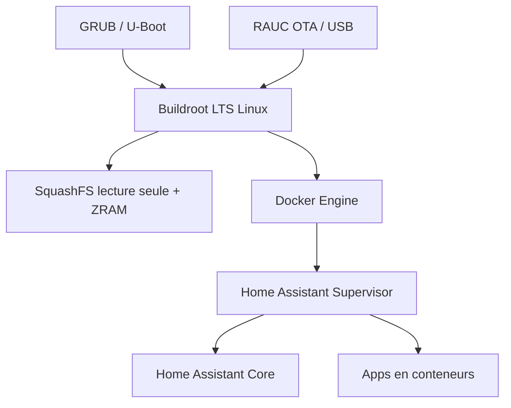

# home-assistant/operating-system

> Système Linux minimal, bâti sur Buildroot, dédié à l'hébergement de Home Assistant.

## Le problème
Installer Home Assistant sur une distribution généraliste apporte des paquets inutiles, une usure
de carte SD par les écritures, et des mises à jour système qui cassent l'installation.

## Ce que ça fait vraiment
Un OS construit avec Buildroot, donc pas dérivé d'Ubuntu ni d'une distribution classique, visant
les cartes type Raspberry Pi ou ODROID, plus le x86-64 UEFI. Docker sert de moteur de conteneurs :
l'OS démarre le Home Assistant Supervisor, qui pilote à son tour le cœur et les applications dans
des conteneurs séparés. Systèmes de fichiers en lecture seule SquashFS compressé LZ4, ZRAM pour
`/tmp`, `/var` et le swap, ce qui limite les écritures. Mises à jour OTA et par USB via RAUC,
durcissement AppArmor, GRUB ou U-Boot selon le support de l'UEFI.

## Comment c'est branché


## Essayer
```bash
# Aucune commande documentée dans le README : il renvoie au guide d'installation
# officiel et aux builds de développement sur os-artifacts.home-assistant.io.
```

## Coût et pièges
Gratuit. Le README prévient : sans expérience des systèmes embarqués, de Buildroot ou de la
construction de distributions Linux, mieux vaut se former d'abord. Les builds de développement
sont déclenchés manuellement par un workflow GitHub Action — ce ne sont pas des versions stables.

## Ce que ce n'est pas
Ce n'est pas une distribution généraliste : on n'y installe pas ses propres paquets comme
ailleurs. Ce n'est pas Home Assistant lui-même — seulement le socle qui l'héberge.

## Alternatives
Aucune alternative nommée dans le README.

## Pour toi
Domotique personnelle uniquement ; aucun rapport avec un usage data ou MLOps.
