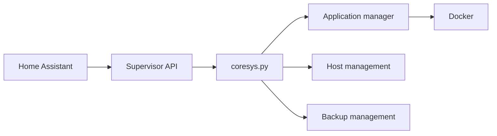

# home-assistant/supervisor

> Plan de contrôle conteneurisé de Home Assistant OS, qui gère applications, réseau, sauvegardes et mises à jour.

## Le problème
Faire tourner Home Assistant Core avec ses modules complémentaires, sa mise à jour et son hôte nécessite une couche d'orchestration.

## Ce que ça fait vraiment
Expose une API pilotée par Home Assistant : installation et mise à jour d'applications dans des conteneurs Docker, réglages réseau, matériel, OS, sauvegardes, montages, découverte de services, résolution de problèmes. Releases en canaux dev, beta, stable. Le README ne détaille rien de plus ; l'installation passe par le site Home Assistant.

## Comment c'est branché

## Essayer
Aucune commande documentée dans le README ; instructions d'installation sur home-assistant.io/getting-started et de développement sur developers.home-assistant.io.

## Coût et pièges
Gratuit, mais pensé pour être installé via Home Assistant OS plutôt qu'à la main.

## Ce que ce n'est pas
Pas une application autonome ni une bibliothèque : composant interne de Home Assistant, sans usage isolé.

## Alternatives
Aucune alternative nommée dans le README.

## Pour toi
À ignorer pour un profil data/IA : c'est de l'infrastructure domotique interne, utile seulement si tu contribues à Home Assistant.

