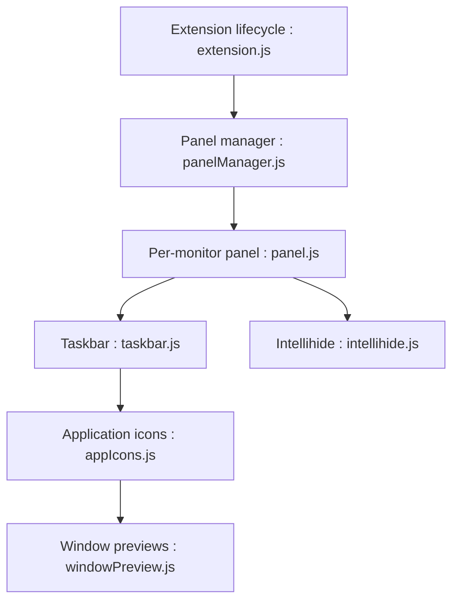

# home-sweet-gnome/dash-to-panel

> Extension GNOME Shell qui fusionne lanceurs et zone système dans une barre de tâches unique.

## Le problème
Le bureau GNOME sépare le dock et le panneau ; certains préfèrent une barre unique façon KDE ou Windows.

## Ce que ça fait vraiment
Déplace le dash dans le panneau principal : icônes d'applications, indicateurs d'exécution configurables, aperçus de fenêtres au survol, lancement par numéro, masquage intelligent, transparence dynamique, multi-écrans, export/import des réglages.

## Comment c'est branché


## Essayer
```bash
dconf reset -f /org/gnome/shell/extensions/dash-to-panel/
```
Installation : depuis GNOME Extensions (le README renvoie à la page officielle).

## Coût et pièges
Gratuit. Testée avec GNOME 3.18+ ; les versions récentes de GNOME peuvent casser les extensions (non documenté ici). Licence GPL-2.0.

## Ce que ce n'est pas
Pas un environnement de bureau, seulement une extension de GNOME Shell.

## Alternatives
Aucune alternative nommée dans le README (il cite des extensions complémentaires comme Arc Menu).

## Pour toi
À ignorer : confort de bureau Linux sans rapport avec data/IA ; installe-la seulement si tu préfères une barre unique.

