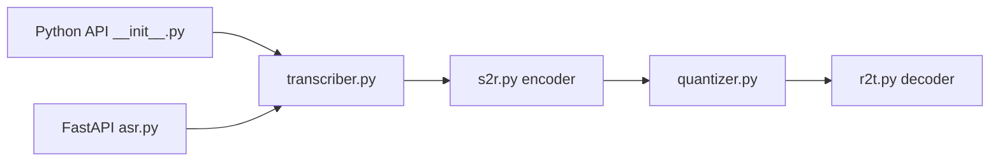

# homebrewltd/ichigo

> Paquet d'inférence pour transcrire la parole et expérimenter un LLM qui écoute.

## Le problème
Les tâches de parole (reconnaissance, synthèse) reposent sur des modèles monolithiques peu réutilisables.

## Ce que ça fait vraiment
Fournit Ichigo-ASR, un tokeniseur de parole de 22M de paramètres pour Whisper-medium, utilisable en Python (`transcribe`) ou via un service FastAPI (transcription, parole vers tokens, tokens vers texte). Ichigo-LLM est un modèle de recherche en fusion précoce ; Ichigo-TTS est « bientôt ». Inférence seulement, pas d'entraînement.

## Comment c'est branché


## Essayer
```bash
pip install ichigo
cd api && uvicorn asr:app --host 0.0.0.0 --port 8000
curl "http://localhost:8000/v1/audio/transcriptions" -H "accept: application/json" -H "Content-Type: multipart/form-data" -F "file=@sample.wav" -F "model=ichigo"
```

## Coût et pièges
Gratuit. Aucune licence dans le dépôt : droits d'usage non définis. Pas de streaming dans l'API.

## Ce que ce n'est pas
Pas un concurrent établi de Whisper : le tableau du README montre `medium.en` meilleur sur la plupart des jeux anglais. Le TTS n'existe pas encore.

## Alternatives
WhisperSpeech (collabora, cité dans les références).

## Pour toi
À surveiller : intéressant pour l'idée de tokens de parole, mais l'absence de licence bloque tout usage sérieux.

