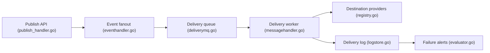

# hookdeck/outpost

> Infrastructure auto-hébergeable d'envoi de webhooks et d'événements vers les systèmes de vos clients.

## Le problème
Ajouter des webhooks sortants à une plateforme SaaS oblige à gérer retries, isolation par client, signatures et suivi des échecs. Les systèmes maison deviennent vite une charge.

## Ce que ça fait vraiment
Reçoit des événements par API ou file, les diffuse par topic vers des destinations (webhook, EventBridge, SQS, S3, Pub/Sub, RabbitMQ, Kafka), avec livraison au moins une fois, retries manuels et automatiques, alertes d'échec et portail client. Dépend de Redis, PostgreSQL et d'une file de messages. SDK Go, Python, TypeScript et serveur MCP.

## Comment c'est branché


## Essayer
```bash
git clone https://github.com/hookdeck/outpost.git
cd outpost/examples/docker-compose/
cp .env.example .env
docker-compose -f compose.yml -f compose-rabbitmq.yml -f compose-postgres.yml up
curl -X PUT "$OUTPOST_URL/api/v1/tenants/acme-corp" -H "Authorization: Bearer $API_KEY"
```

## Coût et pièges
Gratuit en auto-hébergement, mais il faut opérer Redis, PostgreSQL et une file. Version gérée payante (à partir de 10 $ le million d'événements).

## Ce que ce n'est pas
Pas un outil de webhooks entrants ni un bus d'événements interne. Cible les éditeurs de plateformes qui notifient leurs clients.

## Alternatives
Version gérée Hookdeck Outpost (même code, sans exploitation).

## Pour toi
À surveiller : utile si ta plateforme IA doit notifier des clients externes ; sans ce besoin, inutile à un profil data.

