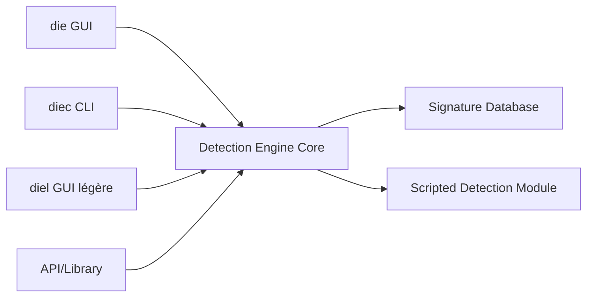

# horsicq/Detect-It-Easy

> Outil multiplateforme d'identification de fichiers et d'inspection statique, pour analystes de malwares et rétro-ingénieurs.

## Le problème
Avant d'analyser un exécutable, il faut savoir ce qui l'a produit, s'il est empaqueté ou protégé, et s'il est endommagé. Sans outil dédié, cette triage est manuelle.

## Ce que ça fait vraiment
Un noyau natif analyse les formats de fichiers ; une base de signatures écrites en DiE-JS (JavaScript) s'y ajoute, avec un moteur heuristique pour les exécutables PE. Le fichier n'est jamais lancé. Les résultats heuristiques sont marqués `(Heur)`. Il intègre aussi NFD, YARA et PEiD. Il existe en interface graphique (die), en ligne de commande (diec) et en version GUI légère (diel).

## Comment c'est branché


## Essayer
```bash
git clone --recursive https://github.com/horsicq/Detect-It-Easy
cd Detect-It-Easy/
docker build . -t horsicq:diec
```
Option documentée : `--heuristicscan` avec `--verbose` pour le rapport le plus complet.

## Coût et pièges
Gratuit, licence MIT. Des faux sites imitent le projet (detectiteasy.com n'est pas affilié) : télécharger uniquement depuis les releases du dépôt. Manipuler des échantillons de malwares exige un environnement isolé.

## Ce que ce n'est pas
Ce n'est pas un antivirus : aucune protection en temps réel, et un rapport vide ne prouve pas qu'un fichier est sain. Un résultat heuristique est une piste, pas une preuve. Les signatures PEiD sont bruyantes.

## Alternatives
- Nauz File Detector : second avis indépendant, base mise à jour moins souvent.
- YARA : règles textuelles et binaires, standard des chercheurs en malwares.
- PEiD : détecteur historique, pour reproduire d'anciennes détections.

## Pour toi
À surveiller : utile en sécurité de la chaîne d'approvisionnement pour inspecter un binaire douteux, mais hors du cœur du travail data / IA.

