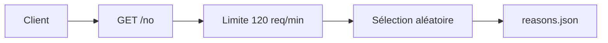

# hotheadhacker/no-as-a-service

> Petite API Express qui renvoie au hasard une excuse pour dire non, par humour.

## Le problème
Il manque parfois une formule polie ou drôle pour refuser, dans un bot ou une page.

## Ce que ça fait vraiment
`GET /no` renvoie un JSON `{ "reason": ... }` tiré au hasard d'un fichier `reasons.json` (plus de 1000 entrées). Limite de 120 requêtes/minute/IP via express-rate-limit. Instance publique hébergée, ou auto-hébergement.

## Comment c'est branché


## Essayer
```bash
git clone https://github.com/hotheadhacker/no-as-a-service.git
cd no-as-a-service
npm install
npm start
PORT=5000 npm start
```

## Coût et pièges
Gratuit. Le README mentionne un sponsoring GitAds et une instance publique (naas.isalman.dev) dont la disponibilité n'est pas garantie.

## Ce que ce n'est pas
Pas une IA : un tirage au hasard dans une liste statique.

## Alternatives
Aucune alternative nommée dans le README (des ports Rust, ASP, etc. sont listés comme projets utilisateurs).

## Pour toi
Ignorer : blague technique, aucune valeur pour un profil data/IA/MLOps.

