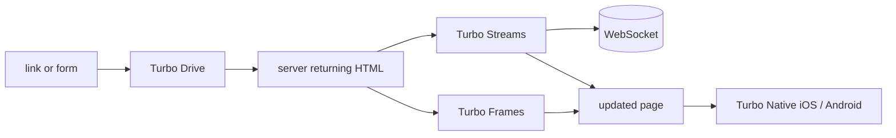

# hotwired/turbo

> **One sentence.** A front-end library that drives navigation and partial page updates by sending HTML instead of JSON.

## The problem

Without it, every link, every form submission and every partial page refresh in a web
application costs hand-written JavaScript. The README states that goal directly: cut down the
amount of custom JavaScript most web applications need to write.

## What it actually does

The README names four complementary pieces. Turbo Drive intercepts links and form submissions
so full page reloads are no longer needed. Turbo Frames splits a page into independent
contexts that scope navigation and can be loaded lazily. Turbo Streams delivers page changes
over WebSocket or in response to a form submission, using HTML and a set of CRUD-like actions.
Turbo Native lets the same web application sit at the centre of native iOS and Android apps.
The common mechanism is stated as-is: it is all done by sending HTML over the wire.

## How it is wired

No code-derived diagram exists for this repository; the graph below is rebuilt from the four
pieces the README names.



## Trying it

```bash
# no install or usage command is documented in the README
```

The README points documentation at `turbo.hotwired.dev` and contribution at `CONTRIBUTING.md`.
Nothing is reconstructed here.

## Cost and gotchas

No API key, no account, no third-party service is mentioned: this is code running in the
browser. The real cost lies elsewhere — Turbo Streams assumes a server able to push HTML over
WebSocket, and the README says neither how nor with which stack. The file read here carries no
install instruction, no version and no prerequisite, so the repository alone is not enough to
evaluate it.

## What it is not

It is not a complete application framework: the README implies as much by pointing to Stimulus
for the cases where Turbo is not enough. It is not a JSON API client nor a data layer — the
README says nothing about client-side state. It is not a standalone mobile SDK either: Turbo
Native is presented as a wrapper around an existing web application, not a replacement for
native development.

## Alternatives

`hotwired/stimulus`, named in the README, is the explicit companion: Turbo for navigation and
page updates, Stimulus when you need JavaScript behaviour attached to the DOM. Among the
catalogue neighbours, `asternic/wuzapi` is unrelated; no other comparable alternative in the
catalogue.

## Why it matters to you

For a data / AI / MLOps profile the value is indirect: it is what lets you serve a dashboard or
an annotation interface rendered server-side without standing up an SPA. If your front end is
already React or Streamlit, skip it.
