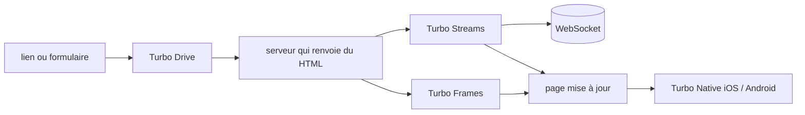

# hotwired/turbo

> **Une phrase.** Bibliothèque front qui pilote navigation et mises à jour de page en envoyant du HTML, pas du JSON.

## Le problème

Sans elle, chaque lien, chaque formulaire et chaque rafraîchissement partiel d'une application
web se paie en JavaScript maison. Le README énonce exactement cet objectif : réduire la
quantité de JavaScript spécifique que la plupart des applications web doivent écrire.

## Ce que ça fait vraiment

Le README décrit quatre briques complémentaires. Turbo Drive intercepte les liens et les
soumissions de formulaire pour éviter le rechargement complet de la page. Turbo Frames
découpe la page en contextes indépendants, qui délimitent la navigation et peuvent se charger
paresseusement. Turbo Streams transmet les changements de page par WebSocket ou en réponse à
un formulaire, avec du HTML et un jeu d'actions de type CRUD. Turbo Native permet d'utiliser
la même application web comme centre d'applications natives iOS et Android. Le principe commun
est annoncé tel quel : tout passe par l'envoi de HTML sur le fil.

## Comment c'est branché

Aucun diagramme tiré du code n'existe pour ce dépôt ; le schéma ci-dessous est reconstruit
depuis les quatre briques nommées dans le README.



## Essayer

```bash
# aucune commande d'installation ni d'usage n'est documentée dans le README
```

Le README renvoie la documentation à `turbo.hotwired.dev` et la contribution à
`CONTRIBUTING.md`. Rien n'est reconstruit ici.

## Coût et pièges

Aucune clé d'API, aucun compte, aucun service tiers mentionné : c'est du code qui tourne dans
le navigateur. Le coût réel est ailleurs : Turbo Streams suppose un serveur capable de pousser
du HTML par WebSocket, et le README ne dit ni comment ni avec quelle pile. Le fichier lu ne
contient ni instruction d'installation, ni version, ni prérequis — il faut aller sur le site
pour tout, ce qui rend l'évaluation à partir du dépôt seul impossible.

## Ce que ce n'est pas

Ce n'est pas un framework d'application complet : le README le dit en creux en renvoyant à
Stimulus « pour les cas où ce n'est pas suffisant ». Ce n'est pas un client d'API JSON ni une
couche de données — rien dans le README ne parle d'état côté client. Ce n'est pas non plus un
SDK mobile autonome : Turbo Native est présenté comme un habillage autour d'une application
web existante, pas comme un remplacement du natif.

## Alternatives

`hotwired/stimulus`, nommé dans le README, est le complément explicite : on prend Turbo pour la
navigation et les mises à jour de page, Stimulus quand il faut du comportement JavaScript
attaché au DOM. Parmi les voisins du catalogue, `asternic/wuzapi` n'a aucun rapport ; pas
d'autre alternative comparable dans le catalogue.

## Pour toi

Pour un profil data / IA / MLOps, l'intérêt est indirect : c'est ce qui permet de servir un
tableau de bord ou une interface d'annotation rendue côté serveur sans monter une SPA. Si ta
stack front est déjà React ou Streamlit, passe ton chemin.
