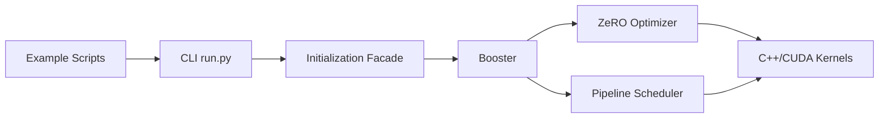

# hpcaitech/ColossalAI

> Bibliothèque PyTorch d'entraînement et d'inférence distribués de grands modèles, pour équipes GPU.

## Le problème
Entraîner un modèle de plusieurs milliards de paramètres exige de combiner parallélismes et optimisations mémoire à la main.

## Ce que ça fait vraiment
Parallélisme de données, pipeline, tenseur (1D à 3D), séquence ; ZeRO ; auto-parallélisme ; offload mémoire hétérogène. Un `Booster` enveloppe le modèle PyTorch ; la CLI `colossalai run` lance les processus. Noyaux CUDA/Triton compilés à la demande. Applications fournies : ColossalChat (RLHF), Colossal-LLaMA, Colossal-Inference.

## Comment c'est branché


## Essayer
```bash
pip install colossalai
BUILD_EXT=1 pip install colossalai
docker build -t colossalai ./docker
docker run -ti --gpus all --rm --ipc=host colossalai bash
```

## Coût et pièges
GPU NVIDIA (capacité ≥ 7.0), CUDA ≥ 11, Linux uniquement. Le README pousse fortement le cloud payant de l'éditeur (HPC-AI).

## Ce que ce n'est pas
Pas utile sur un seul petit GPU pour du fine-tuning courant. Les chiffres d'accélération sont ceux de l'éditeur.

## Alternatives
Aucune nommée comme concurrente (vLLM n'apparaît que comme référence de comparaison).

## Pour toi
À surveiller si tu entraînes au-delà d'un nœud ; sinon trop lourd.
