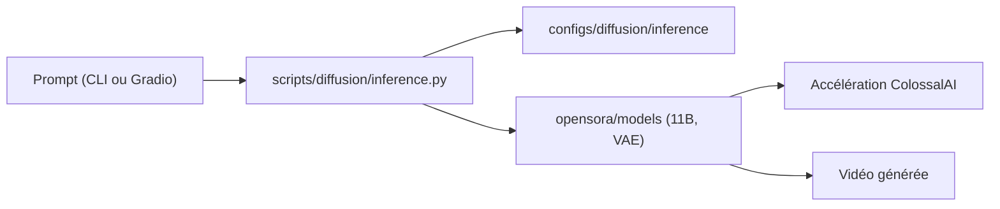

# hpcaitech/Open-Sora

> Modèle ouvert de génération vidéo à partir de texte ou d'image, avec code d'inférence et d'entraînement.

## Le problème
Les modèles de génération vidéo performants sont fermés, et leurs poids, données et recettes d'entraînement restent inaccessibles.

## Ce que ça fait vraiment
Publie un modèle de 11 milliards de paramètres (256 px et 768 px) pour texte vers vidéo et image vers vidéo, avec inférence en ligne de commande via torchrun. Le pipeline texte, image (Flux), vidéo est proposé. D'après le code : scripts diffusion et VAE, configurations, package opensora (accélération ColossalAI, modèles, jeux de données) et une démo Gradio. Le README chiffre le temps de génération : 60 s et 52,5 Go de GPU en 256 px sur un GPU.

## Comment c'est branché


## Essayer
```bash
conda create -n opensora python=3.10
conda activate opensora
git clone https://github.com/hpcaitech/Open-Sora
cd Open-Sora
pip install -v .
huggingface-cli download hpcai-tech/Open-Sora-v2 --local-dir ./ckpts
torchrun --nproc_per_node 1 --standalone scripts/diffusion/inference.py configs/diffusion/inference/t2i2v_256px.py --save-dir samples --prompt "raining, sea"
```

## Coût et pièges
GPU de classe H100/H800 (52 à 60 Go de mémoire annoncés), plusieurs GPU pour 768 px (1 656 s sur un GPU). Installation xformers et flash-attn selon ta version de CUDA. L'affinage du prompt via ChatGPT demande une clé OpenAI facultative.

## Ce que ce n'est pas
Pas équivalent à Sora d'OpenAI : le README revendique seulement un écart réduit sur VBench. Le dépôt promeut aussi un produit commercial (Video Ocean).

## Alternatives
- HunyuanVideo (11B) : comparé au modèle dans le README.
- Step-Video (30B) : autre référence de la comparaison.

## Pour toi
À surveiller : intéressant pour comprendre l'entraînement et l'inférence vidéo distribués, mais exige des GPU que peu d'équipes ont.

