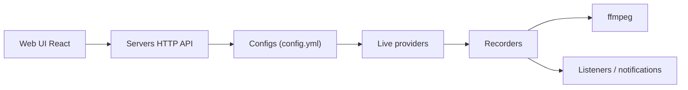

# hr3lxphr6j/bililive-go

> Outil d'enregistrement de directs sur de nombreuses plateformes chinoises et japonaises, avec interface web.

## Le problème
Enregistrer automatiquement des directs quand ils démarrent, sans surveiller les plateformes à la main.

## Ce que ça fait vraiment
Un service Go surveille des salons (Bilibili, Douyu, Huya, Douyin, SOOP, etc.), lance l'enregistrement via ffmpeg et écrit les fichiers dans un dossier. Interface web React pour réglages et lecture des enregistrements, cookies par domaine, notifications Telegram et ntfy, tableau de bord Prometheus et Grafana optionnel.

## Comment c'est branché


## Essayer
```bash
docker run --restart=always -v ~/config.yml:/etc/bililive-go/config.yml -v ~/Videos:/srv/bililive -p 8080:8080 -d chigusa/bililive-go
docker compose up
```

## Coût et pièges
Gratuit. Dépend de ffmpeg. Le README avertit que le code tiers de l'écosystème n'est pas audité. README en chinois. Les cookies sont à récupérer soi-même par site.

## Ce que ce n'est pas
Pas un lecteur ni un service d'archivage : il enregistre des flux. Les droits sur les contenus enregistrés ne sont pas abordés dans le README.

## Alternatives
you-get, ykdl, youtube-dl : cités comme références ; à préférer pour télécharger ponctuellement plutôt que surveiller en continu.

## Pour toi
À ignorer : sans rapport avec la donnée ou l'IA, et centré sur des plateformes de streaming précises.

