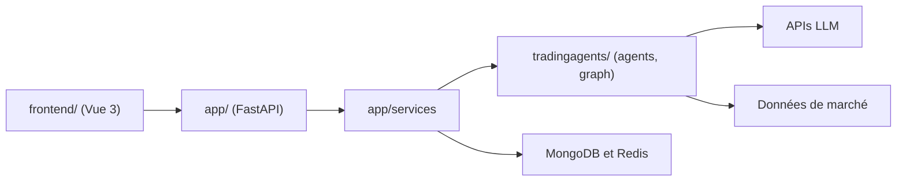

# hsliping/TradingAgents-CN

> Plateforme chinoise d'analyse boursière multi-agents LLM, dérivée de TradingAgents, à des fins d'étude.

## Le problème
Analyser des actions A/H/US avec plusieurs agents LLM demande de brancher données de marché, modèles, files de tâches et interface, en chinois.

## Ce que ça fait vraiment
D'après le code : un backend FastAPI (app/), un front Vue 3 et un moteur partagé tradingagents/ (agents, graphe d'analyse, flux de données, clients LLM). Il stocke tout dans MongoDB, Redis sert au suivi de progression et à la limitation, les rapports vont en Markdown, Word ou PDF. Les données viennent de Tushare, AkShare et BaoStock, les modèles de plusieurs fournisseurs.

## Comment c'est branché

## Essayer
Aucune commande d'installation dans le README : il renvoie à un guide Docker et à un guide d'installation locale.

## Coût et pièges
Modèles LLM à ta charge et données à synchroniser avant analyse, sinon résultats faux. Licence mixte : Apache 2.0 sauf app/ et frontend/, propriétaires et à autoriser pour un usage commercial. Le README annonce que v2 et v3 ne sont pas encore ouvertes.

## Ce que ce n'est pas
Ce n'est pas un outil de trading : le README exclut les ordres réels et les conseils d'investissement. Ce n'est pas non plus le projet d'origine (Tauric Research).

## Alternatives
- TauricResearch/TradingAgents : projet source cité dans le README.

## Pour toi
À ignorer : les parties app et frontend sont propriétaires et le projet dépend d'un seul auteur ; pars du projet amont pour explorer les agents financiers.

