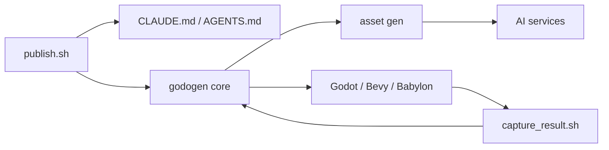

# htdt/godogen

> Générateur de dépôts de jeux où un agent Claude Code/Codex construit un jeu Godot, Bevy ou Babylon.

## Le problème
Faire produire un jeu jouable par un agent échoue souvent : ça compile mais le rendu est cassé.

## Ce que ça fait vraiment
`publish.sh` rend un dépôt de jeu minimal (manifeste, guide moteur, skill d'assets) pour un moteur et un agent hôte donnés.
L'agent reconstruit l'échafaudage, génère des assets via Gemini, xAI Grok et Tripo3D, lance le moteur et capture images/vidéo.
Il juge le résultat sur les captures, pas sur la compilation, et itère.
Sortie : URL live (Babylon) ou vidéo de preuve de 15–20 s.

## Comment c'est branché


## Essayer
```bash
./publish.sh --engine godot   --agent claude --out ~/my-game
./publish.sh --engine babylon --agent codex  --out ~/my-game
./publish.sh --engine bevy    --agent claude --out ~/my-game
```

## Coût et pièges
Trois clés API (Google, xAI, Tripo3D) plus Claude Code ou Codex ; exécutions de plusieurs heures, GPU recommandé.
Nombreux paquets système (vulkan, xvfb, ffmpeg, imagemagick).

## Ce que ce n'est pas
Pas un jeu ni un moteur : un générateur d'instructions pour agent.
Pas testé sous Windows selon le README.

## Alternatives
Aucune alternative nommée dans le README.

## Pour toi
À ignorer : hors domaine data/MLOps ; seule l'idée de boucle d'évaluation par captures est transposable.
