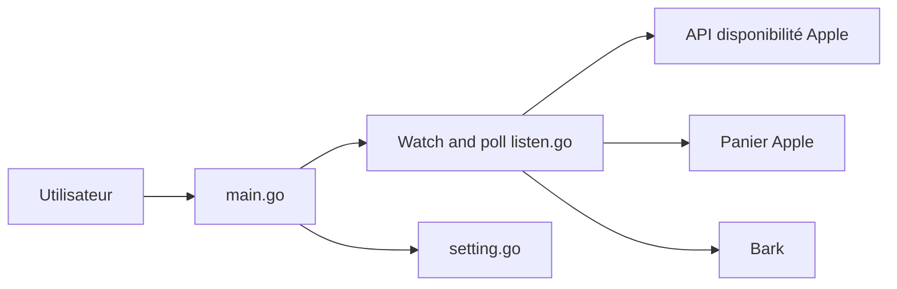

# hteen/apple-store-helper

> Application de bureau qui surveille la disponibilité d'iPhone en boutique Apple et alerte.

## Le problème
Les créneaux de retrait en boutique d'un nouvel iPhone partent vite ; rafraîchir la page à la main est pénible.

## Ce que ça fait vraiment
Interface Fyne (Go) : tu choisis région, boutique et modèle, tu ajoutes à une liste de surveillance et lances l'écoute. Au premier stock détecté, l'app se met en pause, ouvre le panier Apple et notifie localement et, en option, via Bark sur iOS. Ce n'est pas automatisé : sélection de boutique manuelle.

## Comment c'est branché


## Essayer
```bash
go run main.go
./build.sh
```

## Coût et pièges
Gratuit. Il faut être connecté au site Apple et avoir mis le modèle au panier à l'avance. L'auteur prévient que le code est peu soigné. README en chinois.

## Ce que ce n'est pas
Pas un « bot » qui réserve seul. Hors périmètre data/IA.

## Alternatives
Aucune alternative citée dans le README.

## Pour toi
À ignorer : outil de consommation sans rapport avec data, IA ou MLOps, copyleft et sans activité depuis septembre 2025.

