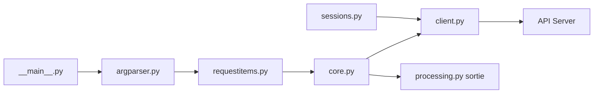

# httpie/cli

> Client HTTP en ligne de commande à syntaxe lisible, pour tester et déboguer des API.

## Le problème
curl est puissant mais sa syntaxe et sa sortie brute ralentissent l'exploration d'une API.

## Ce que ça fait vraiment
Commandes `http` et `https` : syntaxe `clé=valeur` pour du JSON, en-têtes `Nom:valeur`, sortie colorisée et formatée, formulaires et envoi de fichiers, sessions persistantes, authentification, proxies, téléchargement à la wget, mode `--offline` pour construire une requête sans l'envoyer. Un gestionnaire séparé gère plugins et sessions.

## Comment c'est branché


## Essayer
```bash
https httpie.io/hello
http PUT pie.dev/put X-API-Token:123 name=John
http --offline pie.dev/post hello=offline
```

## Coût et pièges
Gratuit. Installation renvoyée vers la documentation externe. Dernier push en décembre 2024.

## Ce que ce n'est pas
Pas un outil de test de charge ni un client graphique (l'app de bureau est un autre produit).

## Alternatives
Aucune nommée dans le README.

## Pour toi
À adopter pour tester tes endpoints de modèles au quotidien.
