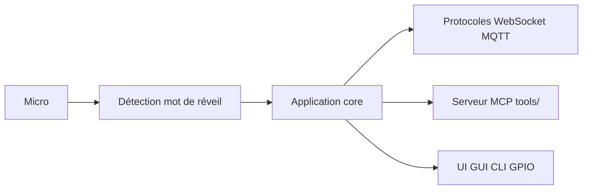

# huangjunsen0406/py-xiaozhi

> Client Python de voix et de vision pour l'écosystème Xiaozhi, du bureau aux cartes ARM.

## Le problème
Faire dialoguer un LLM avec de la voix, une caméra et du matériel (GPIO) sur un poste ou une carte embarquée.

## Ce que ça fait vraiment
Application asynchrone (Python 3.10 à 3.12) : capture audio Opus, mot de réveil hors ligne (Sherpa-ONNX), transmission par WebSocket ou MQTT, machine à états IDLE/CONNECTING/LISTENING/SPEAKING. Un serveur d'outils MCP expose lecteur de musique, caméra, capture d'écran, météo et volume. Trois interfaces : GUI (PySide6/QML), CLI et GPIO. Le code s'organise en plugins avec injection de dépendances.

## Comment c'est branché


## Essayer
```bash
git clone https://github.com/huangjunsen0406/py-xiaozhi.git
cd py-xiaozhi
uv sync
python main.py --mode cli
python main.py --protocol mqtt
```

## Coût et pièges
Micro, haut-parleurs et connexion stable requis ; 4 Go de RAM minimum (8 conseillés) ; modèles de mot de réveil à télécharger. Il faut se connecter à un service d'IA Xiaozhi : le README ne détaille pas lequel ni son coût. Réinstaller les dépendances après chaque mise à jour.

## Ce que ce n'est pas
Pas un assistant autonome : il dépend d'un serveur distant pour l'intelligence. La documentation détaillée est en chinois ; l'architecture générée mentionne des dossiers (`iot`, `display`) absents de l'arborescence du README.

## Alternatives
Aucune alternative n'est citée dans le README (xiaozhi-esp32 et xiaozhi-desktop y sont des projets liés).

## Pour toi
À ignorer : intérêt limité hors écosystème Xiaozhi, service distant opaque, un seul mainteneur.
