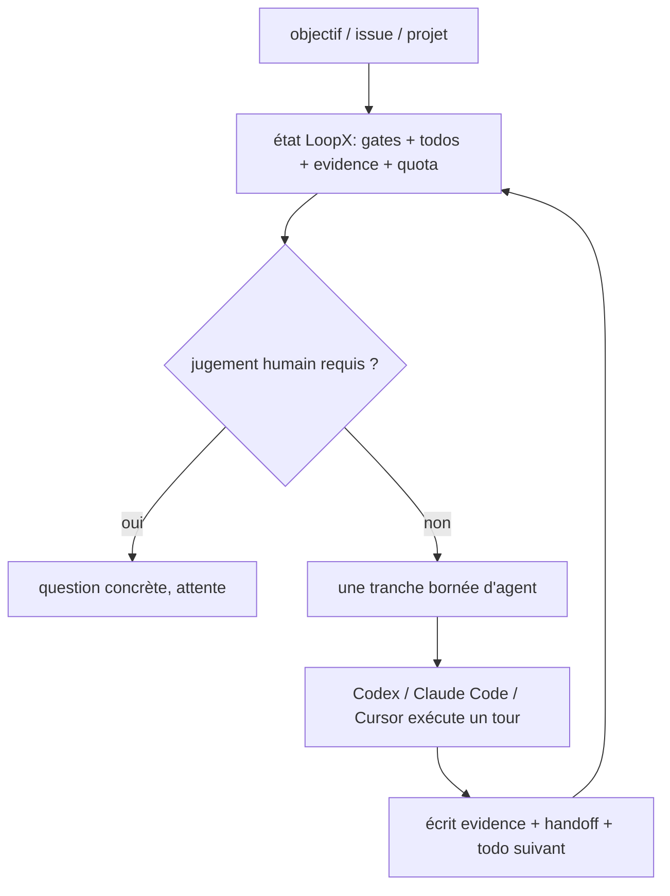

# huangruiteng/loopx

> Plan de contrôle local qui conserve objectifs, portes et preuves d'un agent sur plusieurs jours.

## Le problème
Un agent finit une tâche dans une session ; sur plusieurs jours, l'objectif bouge, les preuves périment et un ordonnanceur continue de dépenser sans transition utile.
La mémoire de chat et un timer ne suffisent pas à gouverner ça.

## Ce que ça fait vraiment
Il garde l'état durable hors de l'agent : objectif, portes (gates), todos, portée, preuves, quota — et décide si le tour suivant doit livrer, demander, attendre ou se taire.
`loopx quota should-run`, `todo claim`, `todo update`, `refresh-state`, `quota spend-slot` forment le tic élémentaire ; l'exécution reste au harnais (Codex, Claude Code, Cursor, shell).
Un espace de travail local-first (`loopx dashboard`) montre ce qui attend un humain, ce qui tourne, ce qui est surveillé ou arrêté, avec preuves et rapports périodiques.
Des capacités packagent des voies de travail : `issue-fix`, `change-quality`, `explore`, `periodic-report`, chacune avec frontière d'écriture et validation déclarées.

## Comment c'est branché


## Essayer
```bash
python3 -m pip install --upgrade loopx
loopx workflow-skills --install
loopx doctor
cd /path/to/your-project
loopx connect
loopx status
```

## Coût et pièges
Python 3.11+ et Node.js 22.18+ (24 LTS recommandé) ; le cœur TypeScript démarre tout seul. Les modèles restent à ta charge via ton harnais.
Le README insiste : ce n'est pas un contrôleur de production autonome — permissions dangereuses, publication et écritures de prod restent humaines.

## Ce que ce n'est pas
Ce n'est ni un framework d'agents ni un runtime d'orchestration lié à un fournisseur : il se pose au-dessus de ce que tu as déjà.
Les « 200+ heures » et les benchmarks (SWE-Marathon, LHTB) sont des essais uniques par tâche, présentés par l'auteur comme n'établissant aucun gain général — et plusieurs cas sont des retours d'utilisateurs non reproduits.

## Alternatives
Aucun projet concurrent n'est nommé dans le README ; il cite OpenViking comme option de mémoire de récompense, pas comme alternative.

## Pour toi
Le vocabulaire (gates, quota, evidence) est juste pour des boucles longues ; attends des cas reproduits avant d'en faire ton ordonnanceur.
