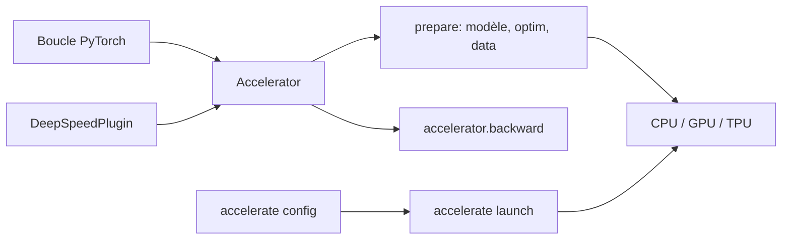

# huggingface/accelerate

> Cinq lignes ajoutées à une boucle PyTorch pour la faire tourner multi-GPU, TPU ou fp16.

## Le problème
Passer une boucle d'entraînement PyTorch du CPU au multi-GPU, au TPU ou à la précision mixte impose
un code de plomberie qu'il faut écrire, maintenir, et retirer pour déboguer en local.

## Ce que ça fait vraiment
Abstrait exactement et seulement cette plomberie. On instancie un `Accelerator`, on passe modèle,
optimiseur et dataloader à `accelerator.prepare(...)`, et on remplace `loss.backward()` par
`accelerator.backward(loss)` : le même fichier tourne sur CPU seul, un GPU, plusieurs GPU ou TPU, avec ou
sans fp8/fp16/bf16. En déléguant le placement des tenseurs, les `.to(device)` disparaissent aussi.
Une CLI optionnelle (`accelerate config`, `accelerate launch`) remplace `torch.distributed.run`.

## Comment c'est branché


## Essayer
```bash
pip install accelerate
accelerate config
accelerate launch examples/nlp_example.py
accelerate launch --multi_gpu --num_processes 2 examples/nlp_example.py
mpirun -np 2 python examples/nlp_example.py
```

## Coût et pièges
Gratuit, Apache 2.0 (en-tête du README). Testé sur Python 3.8+ et PyTorch 1.10+. Le multi-CPU par MPI
suppose Open MPI, Intel MPI ou MVAPICH installés sur le cluster. Le support DeepSpeed est annoncé
**expérimental**. Le vrai coût reste celui des GPU.

## Ce que ce n'est pas
Pas un framework de haut niveau : le README le dit — si vous ne voulez pas écrire votre boucle
d'entraînement, ce n'est pas l'outil. Pas un orchestrateur de cluster non plus. Toute l'API tient dans
une classe, ce qui est une force mais limite ce qu'on peut en attendre.

## Alternatives
- **fastai** : `Learner` qui prend en charge toute la boucle, bâti au-dessus d'Accelerate.
- **Catalyst** : `Runner` reliant matériel, données et entraînement.
- **pytorch-accelerated** : `Trainer` minimaliste, même philosophie de transparence.

## Pour toi
À installer par défaut : coût d'adoption quasi nul, et la porte de sortie vers le multi-GPU est ouverte.
