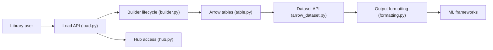

# huggingface/datasets

> Bibliothèque Python pour charger, streamer et prétraiter des jeux de données ML depuis le Hub ou en local.

## Le problème
Chaque dataset public a son format et son script de téléchargement ; les gros volumes saturent la RAM et les prétraitements se relancent inutilement.

## Ce que ça fait vraiment
`load_dataset()` charge un dataset du Hub ou des fichiers locaux (CSV, JSON, Parquet, images, audio, PDF, NIfTI…).
Stockage Apache Arrow mappé en mémoire ; `map()` parallélisable avec cache par empreinte.
Mode `streaming=True` pour itérer sans télécharger ; conversion vers NumPy, pandas, Polars, PyTorch, TensorFlow, JAX, Spark.
Index FAISS et Elasticsearch ; publication sur le Hub.

## Comment c'est branché


## Essayer
```bash
pip install datasets
conda install -c huggingface -c conda-forge datasets
pip install datasets[audio]
pip install datasets[vision]
```

## Coût et pièges
Gratuit. Le cache disque grossit vite ; certains datasets du Hub sont soumis à accès ou licence propres. Épingler la `revision` pour la reproductibilité.

## Ce que ce n'est pas
Pas un outil de versioning de données au sens DVC. Pas garant de la qualité ni des licences des datasets hébergés sur le Hub.

## Alternatives
Aucune alternative nommée dans le README.

## Pour toi
À adopter : brique standard de tout pipeline d'entraînement ou d'évaluation, le streaming et le cache Arrow règlent l'essentiel des problèmes de volume.
