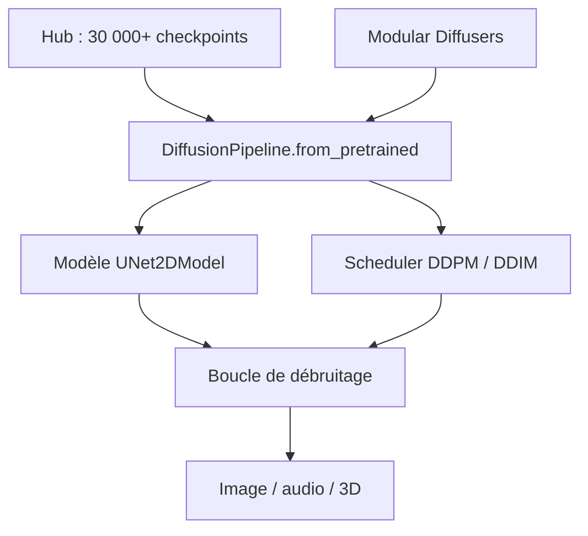

# huggingface/diffusers

> Bibliothèque de modèles de diffusion préentraînés pour générer images, audio et structures 3D.

## Le problème
Chaque modèle de diffusion arrive avec son code, son scheduler et ses conventions de poids.
Passer de l'inférence à l'entraînement, ou changer de scheduler, suppose de réécrire la boucle.

## Ce que ça fait vraiment
Trois composants : des pipelines de diffusion exécutables en quelques lignes, des schedulers de bruit interchangeables, et des modèles préentraînés utilisables comme briques.
`DiffusionPipeline.from_pretrained` charge n'importe lequel des 30 000+ checkpoints du Hub ; on peut aussi descendre au niveau `UNet2DModel` + `DDPMScheduler` et écrire sa propre boucle de débruitage.
Couvre génération inconditionnelle (DDPM), texte→image (Stable Diffusion, unCLIP, DeepFloyd IF, Kandinsky), image→image guidée (ControlNet, InstructPix2Pix), inpainting, variations, super-résolution.
La documentation est découpée en Quickstart, Loading, Modular Diffusers, Optimization et Training ; les conventions pour agents sont dans `.ai/`.

## Comment c'est branché


## Essayer
```bash
pip install --upgrade diffusers[torch]
```

```python
from diffusers import DiffusionPipeline
import torch
pipeline = DiffusionPipeline.from_pretrained("stable-diffusion-v1-5/stable-diffusion-v1-5", dtype=torch.float16)
pipeline.to("cuda")
pipeline("An image of a squirrel in Picasso style").images[0]
```

## Coût et pièges
Gratuit, mais l'inférence en `float16` sur `cuda` suppose un GPU ; les checkpoints pèsent plusieurs Go à télécharger.
Le README annonce une priorité à l'ergonomie sur la performance : pour du service à haut débit, il faudra optimiser.

## Ce que ce n'est pas
Ce n'est pas un serveur d'inférence : c'est une bibliothèque, l'exposition en API reste à votre charge.
Ce n'est pas une garantie de licence sur les modèles : chaque checkpoint du Hub a la sienne.
Ce n'est pas optimisé par défaut : le guide Optimization existe justement parce que le réglage n'est pas automatique.

## Alternatives
Le README ne nomme pas de concurrent : il liste des bibliothèques bâties dessus (InvokeAI, BentoML, kohya_ss) et crédite les implémentations d'origine (CompVis latent diffusion, DDIM d'ermongroup).

## Pour toi
La référence si tu touches à la génération d'images : c'est là que les modèles arrivent en premier.
