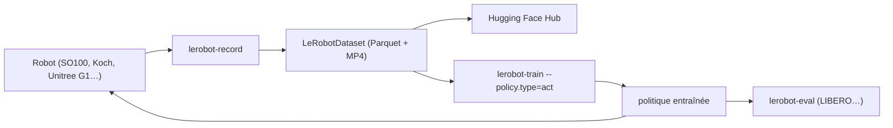

# huggingface/lerobot

> Modèles, jeux de données et outils PyTorch pour la robotique réelle, adossés au Hub.

## Le problème
Chaque laboratoire réinvente son format de données et son interface matérielle : rien ne se partage.
Passer d'un bras à un autre impose de réécrire la collecte, l'entraînement et l'évaluation.

## Ce que ça fait vraiment
Une classe `Robot` unique découple la logique de contrôle du matériel : `connect`, `get_observation`, `send_action`.
Le format `LeRobotDataset` combine vidéos MP4 (ou images) et Parquet pour états/actions, hébergé sur le Hub.
Politiques implémentées en PyTorch pur : imitation (ACT, Diffusion, VQ-BeT), RL (HIL-SERL), VLA (Pi0, SmolVLA, GR00T N1.7), modèles de monde et de récompense.
`lerobot-train` et `lerobot-eval` pilotent entraînement et évaluation, y compris sur les bancs LIBERO et MetaWorld.

## Comment c'est branché


## Essayer
```bash
pip install lerobot
lerobot-info
lerobot-train --policy.type=act --dataset.repo_id=lerobot/aloha_mobile_cabinet
lerobot-eval --policy.path=lerobot/pi0_libero_finetuned --env.type=libero --env.task=libero_object --eval.n_episodes=10
pip install lerobot_robot_<name> lerobot_teleoperator_<name>
```

## Coût et pièges
Les besoins GPU/RAM et les temps d'entraînement par politique sont renvoyés à un guide matériel séparé.
Sans robot, seule la partie simulation et jeux de données est exploitable.

## Ce que ce n'est pas
Ce n'est pas un simulateur : les environnements viennent de bancs externes ou d'EnvHub.
Ce n'est pas plug-and-play matériel : au-delà des robots natifs, les plugins communautaires sont à installer et vérifier.
Les modèles listés couvrent des maturités très différentes (certains annoncés « coming soon »).

## Alternatives
Aucune alternative nommée dans le README ; seulement des plugins matériels tiers et LeLab pour une interface web.

## Pour toi
Hors de ton périmètre sauf projet robotique ; à garder en tête pour le format de dataset multimodal, bien pensé.
