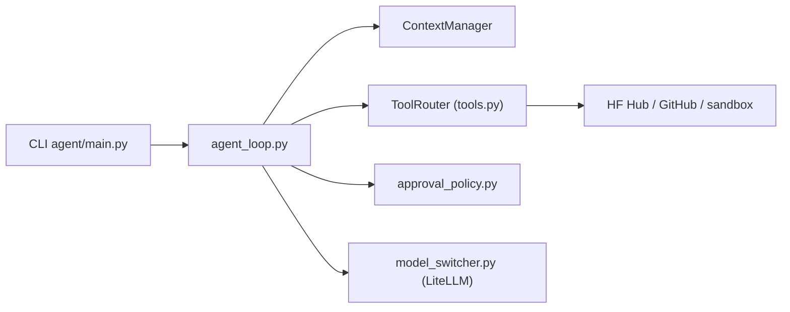

# huggingface/ml-intern

> Agent en ligne de commande, désormais retiré, qui lisait, écrivait et lançait du code ML via l'écosystème Hugging Face.

## Le problème
Enchaîner recherche de docs, code, jobs d'entraînement et publication sur le Hub demande beaucoup de gestes manuels.

## Ce que ça fait vraiment
Une boucle d'agent (`agent_loop.py`, 300 itérations maximum) appelle un LLM via LiteLLM, exécute des outils (fichiers locaux, GitHub, Hub, jobs, papiers, sandbox HF Space, serveurs MCP) et compacte le contexte. Des garde-fous demandent une approbation pour les actions sensibles et détectent les boucles. Les sessions sont envoyées vers un jeu de données Hugging Face privé. L'application web et la CLI sont retirées : le dépôt est conservé pour mémoire.

## Comment c'est branché


## Essayer
```bash
git clone git@github.com:huggingface/ml-intern.git
cd ml-intern
uv sync
uv tool install -e .
ml-intern
```

## Coût et pièges
`HF_TOKEN` et `GITHUB_TOKEN` requis ; l'inférence hébergée est facturée à l'utilisateur HF. Un jeu de télémétrie anonymisée (`smolagents/ml-intern-sessions`) reçoit des lignes de métriques, et l'envoi des traces peut être coupé (`share_traces: false`).

## Ce que ce n'est pas
Pas un projet maintenu : « No support, bug fixes, or security updates ». Le README renvoie vers HuggingChat.

## Alternatives
HuggingChat (indiqué par le README comme successeur).

## Pour toi
À ignorer : dépôt archivé sans mise à jour de sécurité, à lire seulement comme exemple d'architecture d'agent avec approbations et détection de boucles.

