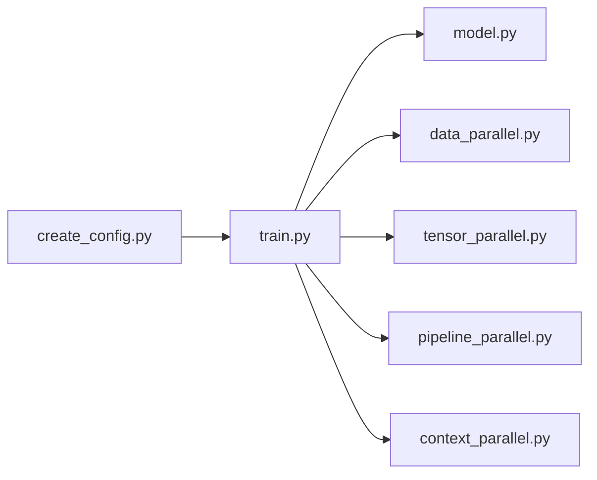

# huggingface/picotron

> Dépôt minimaliste pour apprendre le pré-entraînement de modèles Llama avec parallélisme 4D.

## Le problème
Les frameworks d'entraînement distribué sont trop gros pour comprendre comment marchent data, tensor, pipeline et context parallel.

## Ce que ça fait vraiment
`train.py`, `model.py` et un fichier par parallélisme (data, tensor, pipeline, context, chacun sous 300 lignes selon le README) forment le cœur. `create_config.py` génère un JSON, `torchrun` lance l'entraînement, `submit_slurm_jobs.py` soumet sur Slurm. Un `process_group_manager.py` gère les groupes de communication. Le README annonce 38 % de MFU sur LLaMA-2-7B avec 64 H100.

## Comment c'est branché


## Essayer
```bash
pip install -e .
python create_config.py --out_dir tmp --exp_name llama-1B --dp 8 --model_name HuggingFaceTB/SmolLM-1.7B --num_hidden_layers 15 --grad_acc_steps 32 --mbs 4 --seq_len 1024 --hf_token <HF_TOKEN>
torchrun --nproc_per_node 8 train.py --config tmp/llama-1B/config.json
```

## Coût et pièges
GPU (jusqu'à plusieurs H100 pour les vrais tests) et jeton Hugging Face. Mode CPU possible mais lent. Dernier push en août 2025.

## Ce que ce n'est pas
Pas un outil de production : la performance « n'est pas la meilleure », les benchmarks « viendront ».

## Alternatives
Le README cite Nanotron pour un usage plus complet.

## Pour toi
À surveiller : excellent support pour apprendre le parallélisme distribué, mais inactif depuis plus d'un an, donc pas une base de travail.

