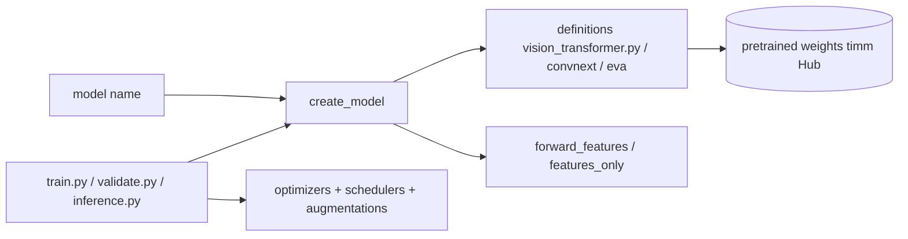

# huggingface/pytorch-image-models

> **One sentence.** The reference collection of PyTorch vision backbones (`timm`), with pretrained weights and training scripts.

## The problem

Without `timm`, every vision architecture (ResNet, EfficientNet, ViT, ConvNeXt, EVA, DINOv3…) ships
in its own repository, with its own API and its own weight format. Comparing two backbones, or
swapping one inside a pipeline, means rewriting the loading code, the classifier head and the
feature extraction each time.

## What it actually does

Gathers image model definitions and their pretrained weights behind one common API: `create_model`,
`get_classifier` / `reset_classifier`, `forward_features`. Every model supports multi-scale feature
map extraction through `create_model(name, features_only=True, out_indices=..., output_stride=...)`,
with channel counts and reduction level queryable after creation via `.feature_info`. The weight
loader adapts the final linear layer and the input from 3 to 1 channel when asked. The repository
also carries its own optimizers (Muon, Adan, Lamb, Lion, kron, Adafactor, the "cautious" variants…),
schedulers (`step`, `cosine` with restarts, `tanh`, `plateau`), augmentations (Mixup, CutMix,
RandAugment, AugMix, Random Erasing) and regularizers (DropPath, DropBlock, Blur Pooling). The
NaFlex pipeline handles variable aspect ratio and variable resolution images.

## How it is wired



No code-derived diagram exists for this repository; the graph above is rebuilt from the README,
which names `vision_transformer.py`, `train.py`, `validate.py` and `inference.py` at the root.

## Trying it

```bash
python validate.py /imagenet --amp -j 8 --model vit_base_patch16_224 --model-kwargs use_naflex=True --naflex-loader --naflex-max-seq-len 256
```

This is the only complete command line present in the README. No installation command is documented
there; the official documentation is pointed to at https://huggingface.co/docs/hub/timm.

## Cost and gotchas

The code is Apache 2.0, but the weights are not all: the README states that ImageNet was released
for non-commercial research purposes only, and that the Facebook WSL / SSL / SWSL models carry an
explicitly non-commercial license (CC-BY-NC 4.0). The README advises seeking legal advice before
commercial use of the weights. The training scripts assume a GPU, in NVIDIA DDP with APEX, in
multi-GPU DistributedDataParallel (AMP disabled, it crashes), or single GPU. Some model variants
carry no weights at all — the README flags this as intended, not a bug.

## What it is not

It is not a detection or segmentation framework: `timm` provides backbones and feature extraction,
and the README points to Detectron2, segmentation_models.pytorch or efficientdet-pytorch for those
tasks. It is not a turnkey training loop either: the root scripts are reference implementations,
"adaptable for other datasets and use cases with a little hacking". And it is not a corporate
project despite the organization hosting it: the README announces in March 2026 the "first
maintenance release since my departure from Hugging Face", and speaks in the first person singular
throughout.

## Alternatives

- **huggingface/transformers**: when vision models are used as multimodal building blocks alongside
  text rather than as classification backbones to be compared against each other.
- **ultralytics/yolov5**: for off-the-shelf object detection, which `timm` does not do.
- **open-edge-platform/anomalib**: for anomaly detection, a specialized use case that consumes a
  backbone rather than providing one.

## Why it matters to you

This is the de facto base layer for vision work in PyTorch: one call to swap a backbone, a stable
feature extraction API, and a catalogue that tracks publications closely (Qwen3-VL, DeepSeek-V4,
Sapiens2 added in September 2026). The thing to check before production is not technical but legal:
the license of the weights, not the one of the code.
