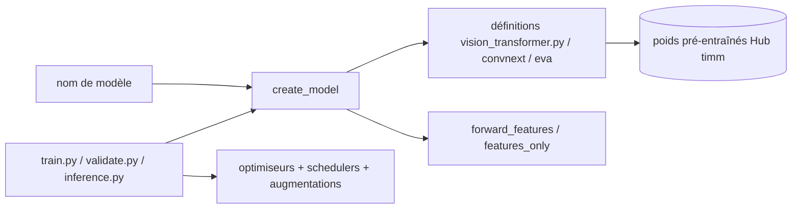

# huggingface/pytorch-image-models

> **Une phrase.** La collection de référence de backbones vision PyTorch (`timm`), avec poids pré-entraînés et scripts d'entraînement.

## Le problème

Sans `timm`, chaque architecture vision (ResNet, EfficientNet, ViT, ConvNeXt, EVA, DINOv3…) arrive
avec son propre dépôt, sa propre API et son propre format de poids. Comparer deux backbones ou en
changer un dans un pipeline suppose de réécrire le chargement, le classifieur et l'extraction de
features à chaque fois.

## Ce que ça fait vraiment

Rassemble les définitions de modèles image et leurs poids pré-entraînés derrière une API commune :
`create_model`, `get_classifier` / `reset_classifier`, `forward_features`. Tous les modèles exposent
l'extraction de cartes de features multi-échelles via `create_model(name, features_only=True,
out_indices=..., output_stride=...)`, avec les nombres de canaux et le stride interrogeables après
création par `.feature_info`. Le chargeur de poids adapte la dernière couche linéaire et l'entrée de
3 à 1 canal si besoin. Le dépôt fournit aussi ses propres optimiseurs (Muon, Adan, Lamb, Lion, kron,
Adafactor, variantes « cautious »…), schedulers (`step`, `cosine` avec restarts, `tanh`, `plateau`),
augmentations (Mixup, CutMix, RandAugment, AugMix, Random Erasing) et régularisations (DropPath,
DropBlock, Blur Pooling). Le pipeline NaFlex gère des images à aspect et résolution variables.

## Comment c'est branché



Aucun diagramme tiré du code n'existe pour ce dépôt ; ce schéma est reconstruit depuis le README,
qui nomme `vision_transformer.py`, `train.py`, `validate.py` et `inference.py` à la racine.

## Essayer

```bash
python validate.py /imagenet --amp -j 8 --model vit_base_patch16_224 --model-kwargs use_naflex=True --naflex-loader --naflex-max-seq-len 256
```

C'est la seule ligne de commande complète présente dans le README. Aucune commande d'installation
n'y est documentée ; la documentation officielle est renvoyée vers https://huggingface.co/docs/hub/timm.

## Coût et pièges

Le code est sous Apache 2.0, mais les poids ne le sont pas tous : le README précise qu'ImageNet a
été publié pour la recherche non commerciale uniquement, et que les modèles Facebook WSL / SSL / SWSL
portent une licence explicitement non commerciale (CC-BY-NC 4.0). Le README conseille de prendre un
avis juridique avant un usage commercial des poids. Les scripts d'entraînement supposent un GPU, en
DDP NVIDIA avec APEX, en DistributedDataParallel multi-GPU (AMP désactivé, il plante), ou mono-GPU.
Certaines variantes de modèles n'ont aucun poids — le README le signale comme voulu, pas comme un bug.

## Ce que ce n'est pas

Ce n'est pas un framework de détection ou de segmentation : `timm` fournit les backbones et
l'extraction de features, le README renvoie vers Detectron2, segmentation_models.pytorch ou
efficientdet-pytorch pour ces tâches. Ce n'est pas une boucle d'entraînement clé en main non plus :
les scripts de la racine sont des références « adaptables à d'autres jeux de données et cas d'usage
avec un peu de bricolage ». Enfin ce n'est pas un projet d'entreprise malgré l'organisation qui
l'héberge : le README annonce en mars 2026 la « première release de maintenance depuis mon départ
de Hugging Face », et parle à la première personne du singulier tout du long.

## Alternatives

- **huggingface/transformers** : si les modèles vision sont utilisés comme briques multimodales avec
  du texte plutôt que comme backbones de classification à comparer entre eux.
- **ultralytics/yolov5** : pour la détection d'objets prête à l'emploi, ce que `timm` ne fait pas.
- **open-edge-platform/anomalib** : pour la détection d'anomalies, un cas d'usage spécialisé qui
  consomme un backbone plutôt qu'il n'en fournit.

## Pour toi

C'est le socle de fait quand on fait de la vision en PyTorch : un seul appel pour changer de
backbone, une API d'extraction de features stable, et un catalogue qui suit les publications de près
(Qwen3-VL, DeepSeek-V4, Sapiens2 ajoutés en septembre 2026). Le point à vérifier avant production
n'est pas technique mais juridique : la licence des poids, pas celle du code.
