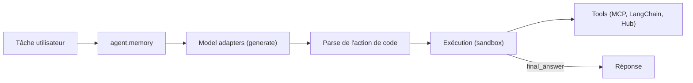

# huggingface/smolagents

> Bibliothèque Python d'agents LLM dont les actions s'écrivent en code, avec exécution en bac à sable.

## Le problème
Les agents qui appellent des outils via du JSON enchaînent beaucoup d'étapes, et brancher modèle, outils et exécution soi-même est laborieux.

## Ce que ça fait vraiment
CodeAgent fonctionne comme un agent ReAct dont le modèle écrit ses actions en extraits Python ; ToolCallingAgent propose l'approche JSON classique. Le modèle est interchangeable (Inference providers, LiteLLM, OpenAI compatible, transformers local, Azure, Bedrock) et les outils viennent de MCP, LangChain ou de Spaces du Hub. La logique tient en moins de 1 000 lignes (agents.py). Le code s'exécute en local ou dans E2B, Blaxel, Modal ou Docker. Deux commandes : smolagent et webagent.

## Comment c'est branché


## Essayer
```bash
pip install "smolagents[toolkit]"
smolagent "Plan a trip to Tokyo, Kyoto and Osaka between Mar 28 and Apr 7."  --model-type "InferenceClientModel" --model-id "Qwen/Qwen3-Next-80B-A3B-Thinking" --imports pandas numpy --tools web_search
```

## Coût et pièges
Modèle hébergé : jeton du fournisseur à ta charge, ou modèle local avec GPU. LocalPythonExecutor n'est pas une frontière de sécurité : du code arbitraire peut s'exécuter, donc un bac à sable est indispensable. Le gain de 30 % d'étapes est un chiffre du README.

## Ce que ce n'est pas
Pas un agent prêt à l'emploi : c'est une bibliothèque à assembler. Le mode local n'isole pas le code généré.

## Alternatives
Aucune alternative citée dans le README.

## Pour toi
À adopter : petite base de code lisible pour prototyper des agents et comprendre la boucle ReAct, à condition d'exécuter dans un bac à sable.

