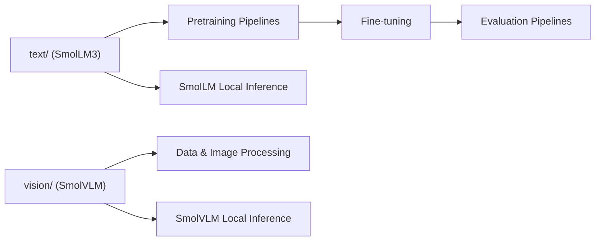

# huggingface/smollm

> Famille de petits modèles ouverts (texte SmolLM3, vision SmolVLM) faits pour tourner sur l'appareil.

## Le problème
Les modèles compacts performants sont souvent fermés ou mal documentés ; on veut des poids et une recette d'entraînement ouverts, utilisables hors serveur.

## Ce que ça fait vraiment
SmolLM3 est un modèle de 3 milliards de paramètres entraîné sur 11 000 milliards de jetons, avec mode de raisonnement double (`think`/`no_think`), six langues dont le français, et contexte jusqu'à 128 000 jetons. SmolVLM traite images et texte (questions visuelles, description). Le dépôt contient le code de `text/`, `vision/` et `tools/` (inférence locale). Le README annonce que SmolLM3 dépasse Llama 3.2 3B et Qwen2.5 3B, et rivalise avec des modèles de 4B ; ces comparaisons sont celles de l'éditeur.

## Comment c'est branché

## Essayer
Aucune commande shell documentée dans le README ; il fournit des exemples Python avec `transformers` (`AutoModelForCausalLM.from_pretrained("HuggingFaceTB/SmolLM3-3B")`).

## Coût et pièges
Gratuit ; l'exemple choisit `cuda` ou `cpu` selon la machine. La description d'architecture parle de SmolLM2 alors que le README met SmolLM3 en avant : suivre le README. La génération de l'exemple autorise jusqu'à 32 768 jetons.

## Ce que ce n'est pas
Ce n'est pas un modèle de la taille des grands LLM : le gain est l'efficacité, pas la performance maximale. Le dépôt est un répertoire de code et de ressources, pas une application. Les scores viennent de l'éditeur.

## Alternatives
- Qwen3 : concurrent de taille voisine cité par le README.
- Gemma3 : concurrent de 4B cité de la même façon.

## Pour toi
À adopter pour un modèle compact ouvert, avec support du français et recette d'entraînement publique : utile en prototypage local ou en pré-tri à faible coût.
