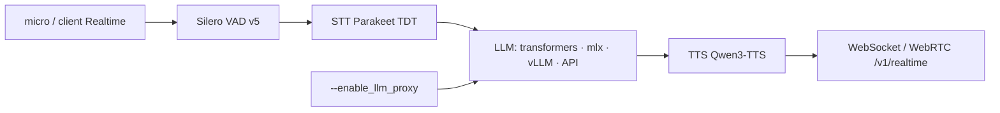

# huggingface/speech-to-speech

> Pipeline d'agent vocal modulaire VAD→STT→LLM→TTS, exposé via le protocole OpenAI Realtime.

## Le problème
Les API vocales temps réel sont fermées et hébergées : impossible de remplacer un maillon ou de
garder l'audio sur sa machine.

## Ce que ça fait vraiment
Quatre composants en cascade, chacun dans son thread, reliés par des files : Silero VAD v5 pour les
frontières de parole, STT (Parakeet TDT par défaut), LLM, puis TTS (Qwen3-TTS par défaut). Chaque
étage a plusieurs backends interchangeables choisis par drapeaux CLI. Le tout est exposé par
WebSocket et WebRTC selon le jeu d'événements central de l'API OpenAI Realtime. Le LLM peut tourner
en local (transformers, mlx-lm), sur ton propre serveur vLLM ou llama.cpp, ou chez un fournisseur.
Un proxy LLM optionnel expose l'upstream comme endpoint OpenAI classique pour des tâches annexes.

## Comment c'est branché


## Essayer
```bash
python3 -m venv .venv
source .venv/bin/activate
pip install speech-to-speech
speech-to-speech local --mac-optimal-settings --model_name mlx-community/Qwen3-4B-Instruct-2507-4bit
speech-to-speech serve
speech-to-speech talk --url ws://127.0.0.1:8765/v1/realtime
docker compose up
```

## Coût et pièges
Gratuit en tout-local, mais il faut de la mémoire : ~16 Go unifiés sur Apple Silicon, ~24 Go de VRAM
sur NVIDIA pour le LLM non quantifié, ~8 Go pour la seule pile vocale. Le mode LLM hébergé envoie
texte transcrit, instructions et historique au fournisseur (l'audio reste local) et facture les
appels. Sur Ubuntu : `libportaudio2`, `libsndfile1`, et une roue `qwentts-cpp-python` adaptée à ta
version de CUDA. Le proxy LLM n'a ni authentification ni limitation de débit : réseau de confiance
ou passerelle devant.

## Ce que ce n'est pas
Ce n'est pas une implémentation complète de l'API OpenAI Realtime : le README parle d'un
sous-ensemble central testé, pas d'équivalence. `serve` écoute sur `127.0.0.1` par défaut, il faut
`--host 0.0.0.0` volontairement. Les implémentations dépréciées (MeloTTS) sont dans `archive/` et
ne sont plus câblées à la CLI.

## Alternatives
Aucun concurrent nommé ; le README documente plutôt les backends interchangeables (vLLM, llama.cpp,
HF Inference Providers, OpenRouter) et le SDK OpenAI Agents comme client testé.

## Pour toi
La brique la plus sérieuse pour un assistant vocal entièrement local ; l'architecture à quatre
étages remplaçables vaut aussi comme modèle de conception.
