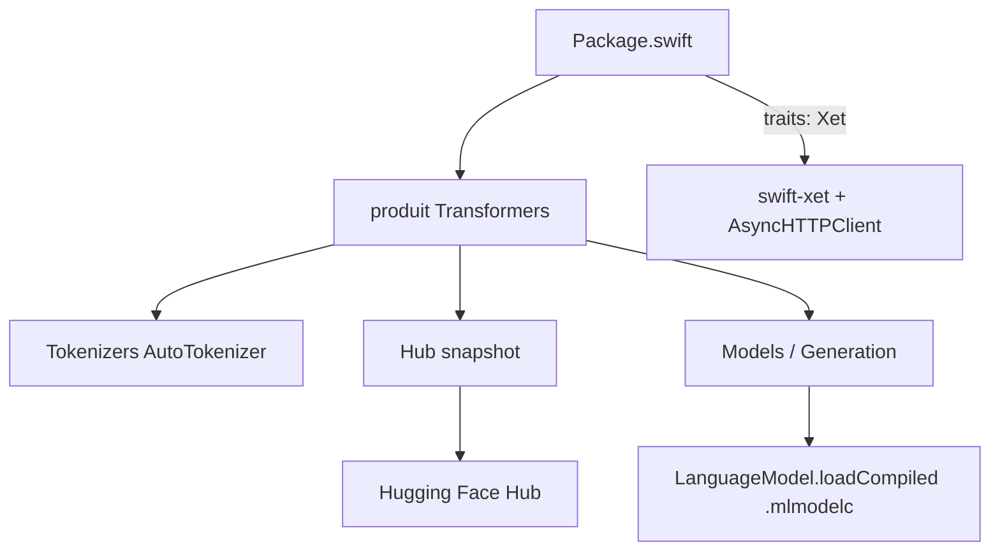

# huggingface/swift-transformers

> Bibliothèque Swift pour tokenisation, templates de chat et téléchargement de modèles depuis le Hub.

## Le problème
Porter une application de modèle de langage sur iOS ou macOS oblige à réimplémenter la tokenisation et les templates de chat.
Télécharger des poids sur un appareil demande de gérer la reprise, la progression et les connexions instables.

## Ce que ça fait vraiment
`AutoTokenizer.from(pretrained:)` reproduit l'API Python familière, avec `applyChatTemplate` et `decode`.
Gère nativement la mise en forme des appels d'outils : on passe une définition de fonction à `applyChatTemplate(messages:tools:)`.
`Hub.snapshot` télécharge un dépôt filtré par motif, avec compte rendu de progression et tolérance aux connexions capricieuses.
Les modules `Models` et `Generation` servent CoreML ; un tokeniseur local peut être injecté dans `LanguageModel.loadCompiled` pour un fonctionnement totalement hors ligne.

## Comment c'est branché


## Essayer
```bash
huggingface-cli download \
  mistralai/Mistral-7B-Instruct-v0.3 \
  tokenizer.json tokenizer_config.json \
  --local-dir Examples/Mistral7B/local-tokenizer
swift build --traits Xet
swift test --traits Xet
```

## Coût et pièges
Le trait `Xet`, qui active les téléchargements parallèles, tire des dépendances transitives et exige Swift 6.1+ ; en deçà, transport `URLSession` par défaut.
Xcode ne sait pas déclarer un trait : le contournement documenté est un paquet local qui réexporte celui-ci.
Un dépôt fermé impose `huggingface-cli login` au préalable.

## Ce que ce n'est pas
Pas un moteur d'inférence : la génération passe par CoreML ou MLX, pas par cette bibliothèque seule.
Pas un équivalent complet de `transformers` : les modules les plus utilisés sont `Tokenizers` et `Hub`.
Les fichiers de tokeniseur doivent venir du même dépôt que le point de contrôle, sans quoi les résultats sont faux silencieusement.

## Alternatives
- WhisperKit : pile Swift dédiée à la transcription, si le besoin est la parole et non un LLM généraliste.
- MLX Swift Examples : intégration de modèles MLX dans une application Swift.
- exporters : conversion CoreML de modèles transformers, en amont plutôt qu'en remplacement.

## Pour toi
Sans objet si tu ne livres pas d'application Apple ; à garder en tête le jour où un modèle doit tourner sur un iPhone.
